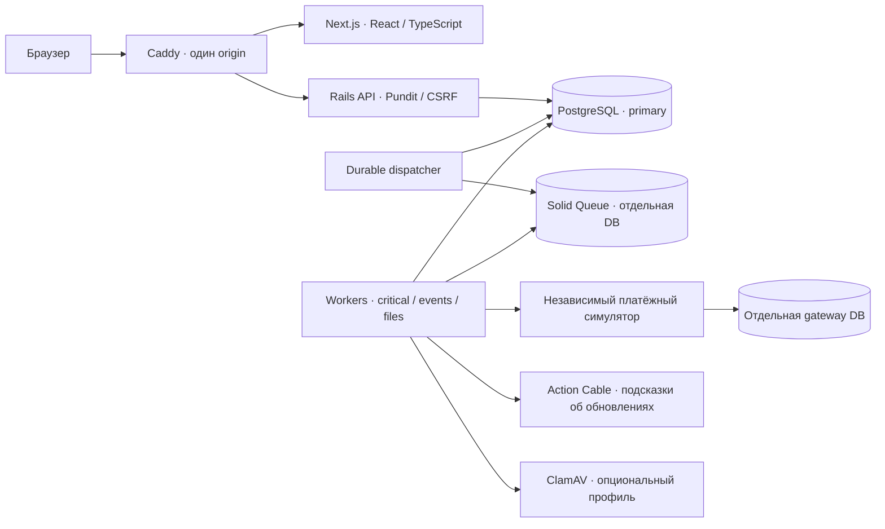

> Это независимый MESH-showcase. Начните с npm run demo и [SHOWCASE.md](SHOWCASE.md). Главный инженерный сценарий — [Integration & Release Lab](docs/publishing-lab.md); [результаты](docs/execution-status.md) отделяют actual runs от подготовленных конфигураций.

# MESH-showcase

Отдельная копия backend и frontend MESH для демонстрации Ruby, Docker, GitHub Actions, Ansible, Terraform, Kubernetes и SRE. Основной продукт находится рядом в `../MESH`; дальнейшие showcase-изменения делаются только здесь.

Начните с [результатов выполнения](docs/execution-status.md) и [демонстрации интервью](docs/interview-demo.md). [SHOWCASE.md](SHOWCASE.md) описывает окружения и изоляцию. [Короткий план](docs/interview-focus.md), [карта DevOps-материалов](docs/devops-skills-map.md), [расширенный backlog](docs/interview-roadmap.md).

Локальный интерфейс после запуска: **http://localhost:3200**. Отдельные Docker project/network/volumes и session cookie не используют окружение основного MESH. Локальные секреты созданы заново; исходные `.env`, credentials, private storage и базы не переносились.

Ниже — документация исходного продукта. Исторические screenshots/evidence описывают исходные проверки, а не новый прогон этой копии.

Creator marketplace на Next.js и Rails. Рабочий сценарий: заказчик публикует бриф → автор предлагает условия → заказчик выбирает автора → автор передаёт результат → заказчик принимает конкретную версию → платёжный симулятор резервирует сумму и выполняет выплату.

Главная: редакционный коллаж, пять направлений, проекты, авторы и шаги работы. Поиск, бюджет и закладки работают с реальными демо-данными. [Дизайн, изображения и проверки](docs/home-design.md).

Каталог авторов продолжает дизайн главной: поиск по имени и навыкам, направления, стоимость, сортировка, сохранённые авторы и подробные профили по ссылке. [Дизайн каталога, изображения и проверки](docs/creators-design.md).

Публичный бриф проекта: редакционная обложка, задача и результат, требования, материалы, история версий и закреплённые условия. Автор отправляет приватное предложение, заказчик уточняет бриф и выбирает автора. [Дизайн страницы и границы возможностей](docs/project-design.md). Для новых полей примените `docker compose exec api bin/rails db:migrate`, затем `docker compose exec api bin/rails db:seed` добавит кофейный демо-проект без изменения существующих брифов.

Finance работает **только с симулятором**. Реальные деньги, карты и live-провайдеры не подключены. Продуктовые гипотезы, включая одного выбранного автора и комиссию 10%, зафиксированы для демонстрационного сценария; точная механика Артёма ещё не получена.

## Запуск

Экран №4 продолжает бриф: панель предложения справа, живой итог, автоматический черновик, приватный пример работы и подтверждение отправки. [Дизайн и поведение формы](docs/proposal-design.md). Для вложений примените миграции, включите `MESH_SCAN_FILES=true` в `.env` и запустите `docker compose --profile files up -d scanner api worker dispatcher`; скачивание открывается после проверки ClamAV.

Экран №5 показывает проект владельцу: предложения авторов, поиск, сортировка, избранные, сравнение до трёх и панель деталей. Выбор требует подтверждения условий и создаёт соглашение; пауза приёма сохраняет текущие отклики. [Поведение и проверки](docs/owner-design.md), [скриншоты](docs/screenshots/owner-redesign/README.md). Миграция и повторный seed добавляют управление приёмом и отдельный демо-проект NORA.

Экран №6 — рабочее пространство после выбора автора: текущий результат, неизменяемая история версий, приватные файлы, замечания заказчика и зафиксированные условия. Автор передаёт новую версию, заказчик принимает последнюю готовую или запрашивает изменения. [Модель и ограничения](docs/workspace-design.md), [скриншоты и проверки](docs/screenshots/workspace-redesign/README.md). После миграций и seed [демо NORA](http://localhost:3200/workspace) доступно автору `design@mesh.local` и заказчику `client@mesh.local` с общим демо-паролем.

Нужен Docker Desktop с Linux containers. Ruby и PostgreSQL на Windows устанавливать не требуется.

```powershell
pwsh -NoProfile -File scripts/setup.ps1
```

Откройте [MESH](http://localhost:3200). При повторном запуске достаточно `docker compose up -d`. Для остановки используйте `docker compose stop`; данные остаются в volume `mesh-showcase_database`.

Демо-аккаунты, пароль для каждого: `MeshDemo2026!`.

| Аккаунт              | Доступ                       |
| -------------------- | ---------------------------- |
| `client@mesh.local`  | Заказчик и создание проектов |
| `creator@mesh.local` | Автор с заполненным профилем |
| `ops@mesh.local`     | Операционный пульт и сверка  |

В симуляторе выберите «Списание успешно, ответ потерян». Сначала появится неопределённый результат, затем worker проверит прежнюю операцию у провайдера. Подтверждение обычно занимает несколько секунд; задержка очереди видна в операционном пульте.

## Устройство



Backend — modular monolith с семью пакетами: `identity`, `talent`, `marketplace`, `engagements`, `finance`, `notifications`, `platform`. SQL-ограничения, row locks, атомарная идемпотентность, outbox, неизменяемая история и двойная запись защищают наиболее важные переходы. Одна инсталляция PostgreSQL содержит несколько логических баз; это не инфраструктурная изоляция отказов.

Подробности: [реализованная архитектура](docs/implementation.md), [решения и альтернативы](docs/adr.md), [эксплуатация](docs/runbooks.md), [результаты проверок](docs/verification.md). Исходный [проект архитектуры](docs/architecture-proposal.md) содержит и дальнейшие возможности; наличие идеи в нём не означает её реализацию.

[Ревизия Ruby backend](docs/backend-hardening.md) устраняет гонки устаревших фоновых задач, переносит лимит входа в общий PostgreSQL budget, запрещает приёмку непроверенных файлов и повторно открывает финансовые расхождения. API readiness, отдельная очередь scanner и ограниченная runtime DB role имеют воспроизводимые проверки.

[Архитектурные доказательства](docs/architecture-proofs.md): 100 000 проектов / 20 000 профилей / 200 000 предложений, SQL-планы до и после индексов, двухминутная нагрузка production API, реальные worker/enqueue/poison failures с Prometheus и восстановление большой DB вместе с приватными файлами и потерянной очередью. Для каждой гарантии описаны стоимость и границы.

[Сценарий демонстрации](docs/demo.md) помогает показать инварианты, реальные отказы и цену архитектурных решений за 10–15 минут.

[Актуальный приоритет подготовки к BGaming](docs/interview-focus.md) показывает Ruby и сообщённый опыт Docker/Kubernetes через CI/CD, наблюдение, диагностику и восстановление. [Расширенный backlog](docs/interview-roadmap.md) сохраняет 33 возможные задачи; весь список не является обязательным объёмом до интервью. Будущие работы отделены от уже полученных локальных доказательств.

[Карта DevOps-материалов](docs/devops-skills-map.md) сопоставляет предоставленные темы VM/Vagrant, Docker/Compose, GitLab CI, Ansible и Terraform с задачами MESH и проверками результата. Темы курса отделены от подтверждённого самостоятельного опыта.

## Проверки

Для Node-команд нужен Node.js 22; lockfiles закреплены в репозитории.

```powershell
npm ci --ignore-scripts --registry=https://registry.npmjs.org
npm run typecheck
npm run format:check
npm run contract:check
npm run test:architecture
npm run build
docker compose run --rm -e RAILS_ENV=test api bin/rails db:prepare
docker compose run --rm -e RAILS_ENV=test api bundle exec rspec
docker compose exec api bundle exec rubocop
docker compose exec api bundle exec packwerk validate
docker compose exec api bundle exec packwerk check
docker compose exec api bundle exec steep check
docker compose exec api bundle exec ruby script/mutation_money.rb
docker compose exec api bundle exec brakeman --no-pager
docker compose exec api bundle exec bundler-audit check --update
npm audit --omit=dev --registry=https://registry.npmjs.org
npm run test:e2e
node scripts/check-model.mjs
powershell -NoProfile -File scripts/restore-drill.ps1
pwsh -NoProfile -File scripts/architecture-lab.ps1
node scripts/check-architecture-evidence.mjs
```

На Windows Playwright использует установленный Edge. На Linux: `npx playwright install --with-deps chromium`; задайте `PLAYWRIGHT_CHANNEL=chromium`. Браузерные тесты добавляют собственные демо-проекты. RSpec очищает только специальную `mesh_test`, включая PostgreSQL-тесты с настоящими параллельными соединениями и commit-time constraints.

OpenAPI находится в `contracts/openapi.json`; авторский генератор — `scripts/build-contract.py`. При изменении контракта выполните `python scripts/build-contract.py`, затем `npm run contract:generate`. Типы frontend и несколько фактических API-ответов проверяются автоматически.

Единый стиль: два пробела, LF, EditorConfig, Prettier и RuboCop. Steep проверяет критичный `Money`; весь Rails backend не объявляется статически типизированным.

После добавления нового каталога autoload, изменения initializers или worker configuration перезапустите `api worker dispatcher`. Браузерные страницы обновляются автоматически; фоновые процессы не перечитывают эти настройки сами.

## Проверка production runtime

`powershell -NoProfile -File scripts/benchmark.ps1` собирает production API, запускает отдельный контейнер на существующей демо-БД, прогревает три публичных endpoint и измеряет 20 запросов/с в течение 30 секунд. Контейнер удаляется в `finally`; JSON-метрики и параметры среды сохраняются в `docs/evidence`. Не запускайте benchmark одновременно с setup, миграциями или browser E2E. Это проверка небольшой локальной выборки, а не подтверждение максимальной пропускной способности.

Для CSP соберите `docker build -f infra/Dockerfile.web -t mesh-showcase-web:verification .`, запустите `docker run -d --name mesh-showcase-web-verification -p 127.0.0.1:3210:3000 mesh-showcase-web:verification` и выполните `node scripts/check-production-csp.mjs`. Проверка относится к standalone frontend и его script policy; полный продуктовый сценарий проверяется отдельно через основной Caddy. По завершении удалите только этот контейнер: `docker rm -f mesh-showcase-web-verification`.

## Наблюдаемость и файлы

```powershell
$env:OTEL_TRACES_EXPORTER = 'otlp'
docker compose --profile observability up -d traces prometheus api worker dispatcher
node scripts/check-observability.mjs
```

[Jaeger](http://localhost:32686) показывает traces; [Prometheus](http://localhost:32090) собирает метрики outbox, неопределённых платежей и расхождений. Внешний Caddy не маршрутизирует `/internal/metrics`; прямой доступ к нему требует отдельного bearer token. Локальные интерфейсы мониторинга не имеют публичной аутентификации и привязаны к localhost. В production нужны закрытая сеть и секреты.

Файлы доступны через приватный API портфолио: загрузка → карантин → ClamAV → разрешённое скачивание владельцем. При отсутствии сканера они остаются в карантине. Для включения: `MESH_SCAN_FILES=true`, затем `docker compose --profile files up -d scanner api worker dispatcher`. Дождитесь загрузки антивирусных баз. Публичные Active Storage URL отключены.

## Сборка и границы готовности

```powershell
docker build -t mesh-api -f infra/Dockerfile.api .
docker build -t mesh-web -f infra/Dockerfile.web .
```

Образы работают от пользователя без root. Миграции запускаются отдельно ролью владельца; API должен использовать ограниченную роль по образцу `infra/runtime-role.sql`. Production требует `SECRET_KEY_BASE`, URL двух баз, HTTPS `MESH_PUBLIC_ORIGIN` и длинный `MESH_METRICS_TOKEN`; платёжные команды по умолчанию отключены. Для демонстрационного production-стенда нужно явно выбрать `MESH_PAYMENTS_MODE=sandbox`.

Подготовлен GitHub Actions workflow, но публикация репозитория, запуск GitHub CI и внешний deployment в этой работе не выполнялись. Email verification, password recovery, организации, лицензирование контента, этапы оплаты, реальный PSP, распределённое ограничение частоты входа и долговременная политика хранения данных требуют отдельного продуктового и эксплуатационного этапа.
