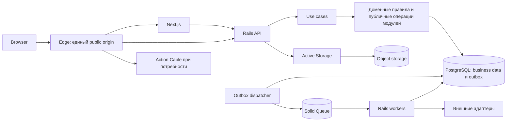

# MESH — архитектурное предложение

Дата: 7 октября 2026 года. Статус: **Proposed**.

Документ сохраняет целевое проектирование. После него реализован рабочий демонстрационный сценарий: фактическое состояние описано в [implementation.md](implementation.md), выполненные проверки — в [verification.md](verification.md). Не все дальнейшие возможности этого предложения реализованы. Технический стек согласован в разговоре; продуктовые гипотезы ещё требуют подтверждения владельцем продукта.

Цель: законченный проект, по которому можно оценить проектирование сложного backend, корректность данных, надёжность, безопасность, эксплуатацию и способность объяснять решения.

**1. Основание и границы решения**

Согласованный стек:

| Область | Выбор |
|---|---|
| Frontend | TypeScript, React, Next.js |
| Анимации | GSAP, Motion |
| Backend | Ruby, Ruby on Rails |
| Данные | PostgreSQL, ActiveRecord |
| Фоновые задания | Active Job, Solid Queue |
| Realtime при потребности | Action Cable |
| Файлы | Active Storage |
| Backend tests | RSpec, FactoryBot |
| E2E | Playwright |
| Авторизация | Pundit |
| Качество и анализ безопасности | RuboCop, Brakeman |
| Контракт API | OpenAPI, JSON |
| Архитектура backend | Modular monolith, use-case слой, умеренный DDD |

Next.js и Rails являются отдельными приложениями. Rails web и Rails workers используют один backend-код и согласованные версии схемы. Worker может масштабироваться отдельно без выделения домена в микросервис.

Достоверное продуктовое основание пока ограничено пересказом идеи «биржи авторов». Дальнейшая модель предполагает подбор исполнителя под конкретную задачу. Покупка готового контента или лицензирование прав могут потребовать другого ядра.

| Гипотеза | Влияние | Что нужно определить |
|---|---|---|
| H1: задача предполагает одного выбранного исполнителя | Кардинальность Award и Engagement | Один автор, команда или несколько мест |
| H2: стороны согласуют работу через платформу | Версии условий, сдача, принятие | Где начинается и заканчивается ответственность MESH |
| H3: деньги проходят через платформу | Finance, ledger, reconciliation | Реальная модель расчётов и возможности провайдера |
| H4: заказчик может представлять организацию | Membership, tenant scope | Нужны ли организации в первой версии |
| H5: есть этапы и частичная приёмка | Milestones и частичные расчёты | Требуется ли это первому сценарию |

Документ позволяет спроектировать сильный демонстрационный сценарий при явных гипотезах. Он не заменяет требования Артёма.

**2. Методологии и результат их применения**

| Подход | Применение в MESH | Проверяемый результат |
|---|---|---|
| EventStorming | События, участники, команды, исключения, временные границы | Карта одного реального процесса и спорных мест |
| Domain Storytelling | Работа автора и заказчика на конкретном примере | Понятный бизнесу сценарий и словарь |
| Strategic DDD | Границы по правилам и владению данными | Context map, допустимые зависимости |
| Tactical DDD | Агрегаты и value objects в сложных операциях | Явные инварианты и переходы |
| Quality attribute scenarios | Конкретные требования к сбоям, нагрузке и изменениям | Таблица стимул → реакция → измерение |
| Risk-driven design | Сначала риски потери данных, чужого доступа и двойных эффектов | Приоритеты проектирования и проверок |
| Example mapping / BDD | Примеры бизнес-правил и исключений | Согласованные сценарии, подходящие для тестов |
| TDD для критических операций | Поведение команд, денег, доступа и повторов | Защита правил при изменениях |
| C4 и sequence diagrams | Структура и критические взаимодействия | Ревью архитектуры на нескольких уровнях |
| ADR | Решение, альтернативы, последствия, условия пересмотра | История инженерных решений |
| Evolutionary architecture | Проверки структуры и совместимости в CI | Изменения сохраняют выбранные свойства |
| SRE practices | SLI/SLO, ошибки, восстановление, runbooks | Измеримая эксплуатационная готовность |
| Threat modeling | Границы доверия и злоупотребления | Связь угроз с контролями и тестами |
| Model checking | Небольшая модель критической гонки | Найденные контрпримеры либо проверенные ограничения модели |

EventStorming по определению предполагает совместное исследование предметной области. Подготовленная самостоятельно карта остаётся черновиком до обсуждения с владельцем продукта. [Источник метода](https://www.eventstorming.com/).

Для проектирования держим отдельные списки facts, assumptions, decisions и evidence. ADR получает статус Accepted только после выбора решения; тестовый отчёт появляется после запуска проверки.

**3. Предлагаемые доменные границы**

| Модуль | Авторитетные данные и правила | Публичное взаимодействие |
|---|---|---|
| Identity | Аккаунты, сессии, при необходимости membership | ActorContext, проверка membership, сессии |
| Talent | Профили авторов, портфолио, видимость | Публичные профили и проверка допустимости участия |
| Marketplace | Задачи, версии брифа, предложения, выбор | PublishProject, SubmitProposal, AwardProposal |
| Engagements | Зафиксированные условия, версии сдачи, принятие | CreateEngagement, SubmitWork, AcceptSubmission |
| Finance, если H3 подтверждена | Финансовые операции, блокировки выплаты, учёт, сверка | PlaceHold, RequestPayout, ApplyProviderObservation |
| Notifications | Намерения уведомить, попытки доставки, настройки | Обработка событий, запрос статуса |
| Trust, если потребуется | Модерация, ограничения, отзывы | Проверка ограничений, обращения, публикация отзыва |
| Messaging, если потребуется | Диалоги, сообщения, участники | SendMessage, список сообщений |

Граница определяется бизнес-ответственностью. Перечень не требует немедленно создавать все модули. Identity, Talent, Marketplace и Engagements являются исходными кандидатами для сценария подбора и выполнения заказа.

Каждый модуль имеет владельца таблиц, публичные команды, публичные запросы и каталог событий. Запись в чужие таблицы проходит через публичную операцию владельца. Межмодульные отчёты используют документированные read contracts или отдельные проекции.

Для атомарного выбора и создания Engagement допускается транзакция приложения, вызывающая публичные операции двух модулей в одной БД. Этот выбор документируется: при физическом разделении сервисов такую гарантию придётся пересмотреть.

Для модульности предлагаются Packwerk с проверками зависимостей, правила RuboCop и architecture tests. Проверки публичности можно добавить через совместимое расширение. Packwerk анализирует статические ссылки на константы; он не контролирует все динамические вызовы, объекты и SQL. Поэтому статическая проверка дополняется ревью и тестами публичного поведения. [Packwerk README](https://github.com/Shopify/packwerk), [Packwerk usage](https://github.com/Shopify/packwerk/blob/main/USAGE.md).

Минимальный shared code: технические результаты операций, Clock, небольшие проверенные value objects. Shared не становится местом хранения бизнес-сущностей всех доменов.

**4. Структура выполнения backend**



При separate database конфигурации Solid Queue база очереди отделена от business database; outbox остаётся в business database. Это допускает отдельный сбой очереди без потери сохранённого намерения выполнить важный эффект.

Контроллер разбирает HTTP, валидирует структуру входных данных, получает actor context, вызывает use case и переводит результат в HTTP-ответ.

Use case координирует доступ, чтение, доменное действие, транзакцию и сохранение событий. Он явно задаёт границы атомарности.

Сущности и небольшие доменные функции описывают правила. ActiveRecord допустим для обычного persistence и локальных правил. Отдельные domain objects вводятся там, где они уменьшают сложность — например, расчёт комиссии, политика доступности выплаты или сложный переход состояния.

Query objects выполняют чтение с явными scope, сортировкой, pagination и выбранными полями.

Ports & Adapters применяем к внешним провайдерам и недетерминированным источникам: PaymentsGateway, NotificationGateway, Clock. Повторяющиеся repository-обёртки вокруг каждого ActiveRecord-класса требуют собственного обоснования.

Паттерны выбираем по конкретным обязанностям:

| Паттерн | Место в MESH | Назначение |
|---|---|---|
| Aggregate | Engagement, Settlement | Защита переходов и локальных инвариантов |
| Value Object | Money, version, deadline | Допустимые значения и безопасные операции |
| Command / Use case | AwardProposal, AcceptSubmission | Явное выполнение пользовательского намерения |
| Query object / logical CQRS | SearchProjects, GetDashboard | Отдельное проектирование чтения |
| Policy | Access и payout eligibility | Правила, зависящие от actor, ownership и состояния |
| Strategy | Версионируемая комиссия или ranking | Смена подтверждённых вариантов правила |
| Adapter + Anti-Corruption Layer | Payment gateway | Перевод provider semantics во внутренние факты |
| Process Manager | Долгий settlement | Долговечный прогресс, deadline и recovery |
| Transactional Outbox + Inbox | Важные события | Атомарное намерение и безопасная повторная обработка |
| Projection | Dashboard, cached balances | Быстрое чтение с явно допустимым lag |
| Bulkhead | Worker pools и resource budgets | Изоляция нагрузки файлов, уведомлений и критических действий |

Specification вводится только при сложных повторяющихся правилах; обычный ActiveRecord scope не требует дополнительных объектов. Saga/compensation применяется к подтверждённому процессу с несколькими внешними эффектами. Event sourcing и отдельная read database остаются альтернативами для ADR, а текущий проект сохраняет авторитетное состояние в обычных таблицах.

Ожидаемый бизнес-отказ выражается типизированным результатом: код и безопасные детали. Неожиданная ошибка инфраструктуры остаётся исключением и получает диагностический контекст.

**5. Domain modelling и версионирование условий**

Предлагаемый словарь для рабочей гипотезы:

- Project: опубликованная задача заказчика.
- BriefVersion: версия описания и условий задачи.
- Proposal: предложение автора с ценой, сроком и ссылкой на версию брифа.
- Award: факт выбора предложения.
- Engagement: согласованная работа между сторонами.
- SubmissionVersion: конкретная версия переданного результата.
- Acceptance: принятие конкретной версии результата.
- Settlement: решение финансовых обязательств по работе, при наличии Finance.
- PaymentOperation: одно намерение выполнить внешний финансовый эффект.

Названия остаются предложением до согласования словаря с бизнесом. Background job обозначает техническое задание Rails и не используется как второе имя Project.

При создании Engagement фиксируем snapshot согласованных условий: участники, scope, стоимость, валюта, сроки, версия предложения, допустимые правки и идентификатор политики комиссии. Ссылку на изменяемый Project дополняем зафиксированными условиями.

Изменение условий после согласования создаёт amendment с новой версией и отдельным подтверждением, если продукт допускает такие изменения.

Принятие относится к SubmissionVersion. Последующее редактирование файла не меняет уже принятую версию. Контрольный hash может помогать установить целостность конкретного артефакта, но сам по себе не является юридической подписью.

Value objects: Money с явной валютой и единицей, срок/момент времени, ScopeVersion, CommissionPolicyVersion. Деньги не представляются float; округление и масштаб валюты задаются явно.

State machines разделяем по ответственности:

| Область | Пример состояния |
|---|---|
| Работа | agreed → in_progress → submitted → accepted; cancellation отдельным переходом |
| Выплата | requested → dispatching → pending/unknown → confirmed/failed |
| Спор | opened → investigating → resolved |
| Файл | quarantined → scanning → available/rejected |

Финансовый статус не подменяет состояние работы. В результате может одновременно существовать accepted work и pending payout.

**6. Критические инварианты**

| ID | Правило | Механизм и доказательство |
|---|---|---|
| I1 | В single-author модели у Project один Award | UNIQUE по project_id, транзакция, конкурентный тест |
| I2 | Award создаёт не более одного Engagement | UNIQUE по award_id, атомарный use case |
| I3 | Proposal относится к согласованной BriefVersion | Версия в контракте, повторная проверка под блокировкой |
| I4 | Изменение условий не переписывает историю | Snapshot и append-only amendments на уровне приложения, права БД по необходимости |
| I5 | Acceptance относится к конкретной SubmissionVersion | FK, допустимый переход, конкурентный тест |
| I6 | Чужие данные недоступны через HTTP, jobs, files и cable | Pundit scopes, объектные проверки, тесты всех точек входа |
| I7 | Один HTTP intent не создаёт второй эффект | Идемпотентность, fingerprint, бизнес-ограничения |
| I8 | Повтор сообщения не повторяет локальный эффект | Inbox/delivery receipt и эффект в одной транзакции |
| I9 | Финансовая проводка сбалансирована в каждой валюте | Контролируемое posting, DB enforcement выбранного уровня, property tests |
| I10 | Один финансовый intent не создаёт вторую операцию | UNIQUE operation_id, durable state, provider contract |
| I11 | Активный hold запрещает начало dispatch выплаты | Один Settlement guard, блокировка и тест гонки |
| I12 | Изменение и важное событие сохраняются вместе | Business transaction + outbox, rollback/failure tests |

I1 — условное правило H1. Модель команды потребует другой кардинальности. I9–I11 применимы только к финансовому варианту.

Каждое правило имеет владельца. Ruby validations дополняются FK, NOT NULL, CHECK, UNIQUE и транзакциями там, где соответствующее ограничение выразимо на уровне БД.

**7. Пример атомарного выбора автора**

```mermaid
sequenceDiagram
  actor Client
  participant API as Rails API
  participant UC as AwardProposal use case
  participant DB as PostgreSQL
  participant Worker
  Client->>API: AwardProposal + Idempotency-Key + brief_version
  API->>UC: validated input + ActorContext
  UC->>DB: BEGIN; reserve idempotency record
  UC->>DB: lock Project; check current permissions and versions
  UC->>DB: create Award; create Engagement snapshot
  UC->>DB: insert outbox event; persist safe result
  UC->>DB: COMMIT
  UC-->>API: EngagementCreated
  API-->>Client: response + resource version
  Worker->>DB: consume durable event
  Worker->>DB: notification intent + delivery receipt transaction
```

Для этой команды заранее выбираем порядок блокировок. Два разных ключа идемпотентности не обходят UNIQUE по project_id. Ошибка конфликта возвращает понятный business code и актуальную версию доступного ресурса.

Внутри транзакции отсутствуют HTTP-вызовы провайдерам, отправка email и обработка файлов.

Optimistic locking подходит для редактирования брифа. Короткая pessimistic lock или условный UPDATE подходят для критического выбора. Serializable рассматриваем для инвариантов, которые затрагивают набор строк и не покрываются более простым механизмом; повторяем всю транзакцию при serialization failure. [PostgreSQL transaction isolation](https://www.postgresql.org/docs/current/transaction-iso.html).

Timeout на lock и согласованный порядок блокировок ограничивают ожидание. Retries имеют предел; конфликт не превращается в бесконечный цикл.

**8. Идемпотентность как часть контракта**

HTTP key scoped по actor/tenant при наличии, операции и ресурсу. Сохраняем fingerprint нормализованного содержимого запроса, status, идентификаторы эффекта и безопасный ответ.

- Повтор key с тем же содержимым возвращает результат уже выполненного намерения, если у actor сохраняется право его видеть.
- Повтор key с другим содержимым возвращает конфликт.
- Параллельный запрос для in-progress key следует документированному контракту ожидания либо retryable conflict.
- Резервирование ключа и локальный эффект атомарны.
- Истечение срока HTTP key не снимает уникальность бизнес-операции.
- Секреты, банковские реквизиты и личные данные не используются в key.

Fingerprint и replay не заменяют текущую проверку доступа. Отзыв membership может запретить выдачу исторического ответа, сохранив идемпотентность изменения данных.

Для фоновой обработки нужны отдельные ключи consumer + event_id и уникальность самого business effect. Для внешнего вызова используется постоянный PaymentOperation.id.

Период хранения ключей у провайдера входит в contract adapter. В частности, Stripe допускает удаление idempotency keys после 24 часов, поэтому бесконечный безопасный retry внешней операции на одном key предполагать нельзя. Неизвестные операции за пределами безопасного окна отправляются на сверку и разбор. Это пример требования к адаптеру, выбор платёжного провайдера ещё не сделан. [Stripe idempotent requests](https://docs.stripe.com/api/idempotent_requests).

**9. События и доставка**

Синхронные вызовы используем для проверки прав, допустимости перехода и атомарных решений. События распространяют уже произошедшие факты и запускают независимые последствия.

Event envelope: event_id, type, schema_version, aggregate_id, aggregate_version, occurred_at, correlation_id, causation_id; tenant_id при наличии. Payload содержит небольшой allowlist полей и ссылки на авторитетные данные.

Domain event внутри процесса и долговечный integration event имеют разные требования к совместимости. Объекты ActiveRecord и полные профили пользователей не сериализуются в долговечные payload.

Outbox хранится вместе с бизнес-изменением. Для нескольких подписчиков delivery progress хранится отдельно по паре event_id + consumer. Передача job в очередь и завершение business effect являются разными состояниями доставки.

Dispatcher работает короткими batch, имеет claim/lease, восстановление просроченных claim и повторное сканирование. Он не удерживает DB lock во время внешнего HTTP-вызова. Принятый очередью job ещё не считается успешно обработанным событием.

Локальный consumer сохраняет эффект и processed receipt в одной транзакции. Mark-as-processed до выполнения эффекта запрещён. Внешний consumer использует устойчивый intent и контракт идемпотентности внешней системы.

Ожидаем повторы. Для важного эффекта задаём срок, после которого retry переходит в quarantine/операторский разбор. Ошибка не исчезает после отметки «delivery failed».

Изменения одного агрегата используют version. При необходимости consumer проверяет порядок, ожидает пропущенную версию или читает актуальное состояние владельца. Очередь не считается глобальным FIFO.

Solid Queue поддерживает транзакционность с бизнес-данными при соответствующей shared database конфигурации. Предлагаемый outbox нужен для каталога долговечных фактов, нескольких consumers, контролируемой доставки и возможности separate queue database. Простым заданиям достаточно Active Job. after_commit enqueue решает запуск до commit, но не устраняет окно падения между commit и enqueue в отдельную систему. [Solid Queue transactional integrity](https://github.com/rails/solid_queue#jobs-and-transactional-integrity).

**10. Долгие процессы и работа с неопределённостью**

Durable process manager хранит шаг процесса, ожидаемый ответ, next_retry_at, deadline, attempt и ссылки на intent. Active Job является механизмом исполнения; состояние процесса находится в бизнес-БД.

Категории ошибок:

| Категория | Реакция |
|---|---|
| Business rejection | Терминальный результат с понятным кодом |
| Временная ошибка инфраструктуры | Ограниченный retry с exponential backoff и jitter |
| Невалидные данные / неподдерживаемая версия | Quarantine и диагностика |
| Timeout после возможного принятия операции | unknown; проверить результат до решения о новом действии |
| Длительная недоступность | Приостановить новые эффекты, сохранить intent, уведомить ответственного |

Компенсация является новой бизнес-операцией со своими правилами. Выплата и возврат не считаются обычным rollback PostgreSQL.

Solid Queue concurrency limits используем для распределения нагрузки. Correctness опирается на бизнес-БД и внешние контракты: временная semaphore и её expiry не обеспечивают exactly-once эффект.

Дедлайны и wakeups восстанавливаются повторным поиском overdue processes. Одно потерянное scheduled job не делает процесс навсегда зависшим.

**11. Финансовый вариант**

Finance включается, если MESH принимает на себя финансовые операции или обязательства. При расчётах сторон вне платформы этот объём не требуется.

Деньги проектируем как два связанных слоя:

1. Ledger: внутренний учёт того, что система признала финансовым фактом.
2. Payment operations: обращения к провайдеру и наблюдения его фактического состояния.

LedgerTransaction содержит сбалансированные Entries по отдельным валютам. Posted записи исправляются reversal/corrective posting. Cached balance является проверяемой проекцией проводок.

Сумма строк разных валют не складывается в один баланс. Комиссии и округления имеют policy version; условия не пересчитываются задним числом из текущей настройки.

CHECK одной строки недостаточно для суммы проводок транзакции. Предлагаем controlled posting path с ограниченными DB privileges и deferred constraint trigger/функцией, если требуется защита от обхода приложения. Этот механизм выбирается отдельным ADR и тестируется прямыми SQL-попытками нарушения.

PaymentOperation создаётся до сетевого вызова. Worker:

1. Короткой транзакцией проверяет Settlement, hold, допустимость действия и переводит intent в dispatching.
2. Выполняет запрос провайдеру вне транзакции со стабильным operation key.
3. Сохраняет наблюдение результата.
4. При timeout переводит операцию в unknown и запускает проверку статуса.
5. Подтверждённый результат создаёт единственный локальный эффект и событие.

Открытие спора и перевод payout в dispatching используют общий Settlement guard. Если hold выигрывает гонку, payout не начинается. Если dispatching уже начался, интерфейс не обещает остановить внешний перевод: действуют правила позднего спора, сверка и при необходимости отдельная компенсация. Это бизнес-решение требует согласования.

Webhook проверяет подпись на исходном body, сохраняет receipt и намерение обработки, затем отвечает провайдеру. Дубли event_id отсекаются, но разные event_id одного business effect также не создают повторную проводку.

Порядок webhook не считается порядком изменения состояния. Применение наблюдений использует контракт конкретного провайдера, допустимые переходы и запрос актуального состояния при неоднозначности. Stripe прямо допускает дубли и доставку не по порядку. [Stripe webhooks](https://docs.stripe.com/webhooks).

Reconciliation сопоставляет локальные intents, provider objects, подтверждённые движения и ledger. Несоответствие создаёт видимую exception, а исправление имеет audit trail.

Sandbox adapter должен уметь моделировать timeout-after-success, delayed confirmation, duplicates, reversed delivery order, отказ и временную недоступность. Затем те же contract tests применяются к реальному sandbox выбранного провайдера.

Выбор платёжной схемы, возможности удержания средств и реальные обязанности платформы остаются отдельными продуктовыми условиями. Наличие ledger само по себе не означает поддержку escrow.

**12. API, типы и совместимость**

OpenAPI является явным источником HTTP-контракта. Выбранная версия спецификации и generator фиксируются вместе. В CI проверяем schema, совместимость изменений, генерацию TypeScript клиента и соответствие реальных ответов контракту. [OpenAPI specification](https://spec.openapis.org/oas/v3.1.1.html).

Commands выражают действия бизнеса: publish, award, submit, accept. Чтение использует ограниченные query endpoints. Поля допустимы по allowlist; mass assignment исключается.

Ошибки имеют стабильный code, безопасное message, field errors при необходимости и request_id. Internal stack trace возвращается только в защищённой диагностике.

Редактирование возвращает resource version; stale write получает conflict. HTTP идемпотентность описана в спецификации важных команд.

Cursor pagination имеет стабильный tie-breaker и документированную семантику при изменениях ленты. Cursor связан с query и scope, при необходимости подписывается. Сортировка и размер страницы ограничены.

Типизированные DTO нужны на границах. Money, actor context и состояния процесса получают явные типы. Sorbet или RBS остаются кандидатами для небольшого пилота в критическом модуле; выбор одного подхода делаем после проверки пользы и стоимости поддержки.

Contract versioning учитывает HTTP API, event payload, job arguments и rollout нескольких версий Rails. Переименование Ruby-класса задания учитывает уже сохранённые jobs.

**13. Безопасность, идентичность и данные**

Предлагаем единый public origin с маршрутизацией Next.js, Rails API и Cable. Rails владеет сессией; cookie защищается Secure, HttpOnly и обоснованным SameSite. Browser mutations проверяют CSRF даже при JSON API. Конкретная схема SSR forwarding и доверенные proxy headers описываются перед реализацией.

Pundit проверяет действие и объект; policy scope применяется к спискам и экспорту. Проверки распространяются на файлы, подписки Cable, административные операции и фоновые команды.

Для пользовательского отложенного намерения явно решаем, какие права перепроверяются при исполнении. Системное исполнение принятого intent не использует сохранённую browser session и не полагается на произвольный actor_id из payload.

Role не сводится к одному user.role: один человек может быть автором и заказчиком, а права зависят от ownership, membership и состояния объекта. Organizations вводятся при подтверждении H4.

RLS можно рассмотреть как дополнительную защиту tenant data. Пилот должен проверить pool context leakage, jobs, backup и роли: владельцы таблиц и BYPASSRLS обходят политики, если не принять соответствующие меры. [PostgreSQL row security](https://www.postgresql.org/docs/current/ddl-rowsecurity.html).

Загрузка файла создаёт quarantine state. Проверяем размер, фактический тип, принадлежность blob, результат сканирования и возможность безопасного преобразования. Пользователь не может прикрепить чужой blob через известный signed identifier.

Приватная выдача файла проходит актуальную проверку доступа и затем короткий capability URL либо proxy. Уже выданная signed URL имеет окно действия; для немедленного отзыва доступа выбирается другой механизм выдачи.

Cable subscription проверяет участника, origin, ограничения и изменение доступа. Reconnect восстанавливает состояние через HTTP; broadcast является подсказкой обновить состояние.

Audit critical actions: actor, действие, объект/версия, причина, время, correlation_id. Логи, metrics labels, trace baggage и event payload не содержат токены, полные сообщения и платёжные реквизиты.

Retention и удаление данных охватывают основной storage, события, audit, индексы, временные файлы и backup policy. Append-only история минимизирует персональные данные и сохраняет ссылки на записи с отдельно управляемым сроком хранения.

Проверки безопасности связываем с релевантными требованиями OWASP ASVS. Формальное заявление о соответствии допускается только после проверки выбранного scope. [OWASP ASVS](https://owasp.org/projects/asvs).

**14. Поиск, realtime и производительность**

Первая поисковая реализация использует PostgreSQL с измеряемыми индексами, при необходимости full-text/trigram. План запроса оценивается на репрезентативных данных, включая популярные категории и участников с большим числом объектов.

Ranking policy объяснима: явные признаки, веса/правила, версия и стабильный tie-breaker. Алгоритм не обещает объективность без определённого продуктового критерия.

Query budgets ограничивают N+1, количество строк и ответ. Анализируем EXPLAIN, DB pool saturation, lock wait и p95/p99 отдельно для чтений и команд.

Кэш вводится после измерения повторяющегося bottleneck. Авторитетная проверка доступа не зависит от устаревшей публичной проекции. Общий кэш не содержит приватных данных без scope.

Read projections для тяжёлых dashboard строятся отдельно и явно допускают lag. Rebuild читает авторитетные таблицы; shadow projection догоняет изменения с контролем версий и tombstones для удалений до переключения. Конкретный протокол snapshot/catch-up проверяется отдельным тестом.

Realtime отправляет resource_id и version, когда этого достаточно. HTTP остаётся источником актуального состояния после reconnect и пропущенного сообщения.

Очереди критических процессов, уведомлений и обработки файлов имеют отдельные лимиты ресурсов. Backpressure, ограничения запросов, upload limits и timeout защищают transactional workload.

**15. Наблюдаемость и эксплуатация**

Trace context проходит через edge/Next.js, Rails, outbox, jobs и внешние адаптеры. Асинхронные spans связываются через propagated context либо span links с учётом длительных процессов. correlation_id и operation_id дополняют traces и не используются для авторизации. [OpenTelemetry context propagation](https://opentelemetry.io/docs/concepts/context-propagation/).

Минимальные dashboards:

- Доступность и latency важных HTTP-операций.
- DB connections, длительные запросы, lock waits.
- Возраст старейшего необработанного outbox delivery.
- Queue lag, retry rate, failed/quarantined processes.
- Unknown payment operations и reconciliation exceptions.
- File scanning backlog.
- Бизнес-воронка с определёнными правилами подсчёта.

Начальные цели — предложения для проверки после первого benchmark:

| Характеристика | Предварительная цель | Условие |
|---|---|---|
| Core HTTP availability | 99.9% за 30 дней | Только определённые user journeys и корректные requests |
| Command latency | p95 ≤ 300 ms, p99 ≤ 1 s | Server-side, без ожидания внешнего провайдера |
| Outbox latency | 99% eligible effects начинают обработку ≤ 30 s | Нормальная доступность зависимостей |
| Notification | 99% переданы провайдеру ≤ 60 s | Передача не означает доставку пользователю |
| Restore | RPO ≤ 15 min, RTO ≤ 60 min | После выбора backup scheme и успешного drill |

SLO подтверждается измерениями, а не наличием dashboard. Для демонстрационного проекта отдельно показываем synthetic monitoring и лабораторные тесты; они не доказывают многомесячную production availability.

Business conflicts вроде already_awarded не смешиваем с internal errors. Error budget используется для приоритизации reliability work. [Google SRE: implementing SLOs](https://sre.google/workbook/implementing-slos/).

Safety constraints, включая отсутствие двойного финансового эффекта, имеют нулевую допустимость нарушения. Такой критерий требует проверок модели и кода; проценты доступности его не заменяют.

Runbooks описывают queue outage, unknown payout, provider outage, corrupted projection, backup restore и неудачную миграцию. Оператор видит evidence и может запускать контролируемый retry; ручное изменение status в БД не является штатным восстановлением.

**16. Изменения, доставка и восстановление**

Pipeline: lint → domain/request/integration tests → concurrency/failure suite → contract/architecture checks → security/dependency checks → E2E → build immutable artifact.

Секреты и production данные не попадают в fixtures. Dependency inventory/SBOM и provenance добавляются как проверяемые build artifacts; соблюдение стандарта supply-chain не заявляется по одному наличию файла.

Deploy учитывает old/new web и workers. Expand-contract migrations поддерживают переходный период; долгие backfills отделены от deploy transaction. Выбор concurrent index и lock/statement timeouts зависит от конкретной миграции.

Feature flags разделяют rollout и необратимые действия. Kill switch payout останавливает новые dispatch, но продолжает принимать подтверждения и сверять уже начатые операции.

Readiness проверяет способность обслужить запросы; liveness не вызывает бесконечный restart при временной недоступности внешнего провайдера.

Backup plan охватывает business data, objects, ключи конфигурации и состояние финансовых intents. Отдельно определяем, какие jobs можно восстановить из outbox/process state.

После restore финансовая dispatch приостановлена до reconciliation: backup может не содержать уже выполненный провайдером эффект. Простое возобновление старых jobs опасно.

**17. Проверки и формальные модели**

Подробная программа проверки находится в [assurance-plan.md](assurance-plan.md).

Высокая ценность проверок:

- Реальные конкурентные транзакции на разных DB connections.
- Перестановки событий и повторные deliveries.
- Падение между внешним успехом и локальным сохранением.
- Properties money math, posting и переходов состояния.
- Model-based последовательности submit/accept/cancel/dispute.
- Контракт адаптера с simulator и реальным sandbox.
- Restore drill с уже начатой внешней операцией.
- Проверка совместимости старого worker payload с новой версией.

Concurrency tests используют barrier и явную синхронизацию вместо sleep. Проверки ограничений БД проходят на PostgreSQL с настоящим commit; обёртка transactional fixtures не подменяет этот сценарий.

Mutation testing применяем к ограниченному набору критических правил. Coverage помогает найти пробел, но не является самостоятельным критерием корректности.

TLA+/PlusCal пилот моделирует Award concurrency либо payout/hold/timeout. TLC проверяет ограниченную модель и её предпосылки, а не Ruby implementation. Связь модели с кодом подтверждается тестами и документированным соответствием. [TLA+ и инструменты](https://lamport.azurewebsites.net/tla/tla.html).

**18. Эволюция и стоимость**

Первый deploy: Next.js, Rails web, Rails workers, PostgreSQL, object storage. Количество БД для очереди выбирается отдельным ADR.

Масштабируем сначала worker pools и web instances, исправляем query plans и pool sizing. Специализированный search engine рассматриваем после измеренной проблемы качества/стоимости поиска.

Физическое выделение домена требует новых решений по согласованности, ownership, миграции данных, версиям событий, доступности и восстановлению. Публичные границы уменьшают стоимость перехода, но не делают его автоматическим.

Триггеры пересмотра: измеренное взаимное влияние workload, независимые требования к доступности, особенности deployment, отдельная команда-владелец и приемлемая операционная стоимость.

Cost evidence: стоимость на workload, storage growth, provider calls на один intent, размер queue/outbox retention и время инженерной поддержки. Оптимизацию оцениваем вместе с надёжностью.

**19. Реализация по завершённым этапам**

| Этап | Результат | Условие завершения |
|---|---|---|
| A. Модель и архитектурный скелет | Словарь, гипотезы, один journey, context map, первые ADR | Правила и границы понятны; неподтверждённые решения помечены |
| B. Вертикальный сценарий | Project → Proposal → Award → Engagement → Submission → Acceptance | Реальный UI/API/DB E2E, права и версии условий |
| C. Надёжность | Idempotency, constraints, outbox, recovery | Повторы, гонки и отказ очереди проходят проверки |
| D. Finance при H3 | Ledger, process manager, adapter, reconciliation | Unknown outcomes, hold race и restore сценарии проверены |
| E. Эксплуатация | Traces, SLO draft, deploy, migrations, restore, benchmark | Воспроизводимые отчёты и runbooks |
| F. Advanced proof | TLA+ модель, mutation scope, selected typing | Проверенные результаты и описанные ограничения |

Каждый этап оставляет runnable, обозримый результат. Demo, private fixtures и staging infrastructure различаются.

**20. Архитектурные решения для первых ADR**

1. Монолит, владение данными и допустимые межмодульные транзакции.
2. Структура modules, публичные API и границы статической проверки.
3. Identity/session topology Next.js ↔ Rails.
4. Award concurrency и database constraints.
5. Версии согласованных условий и submission.
6. HTTP idempotency и business-effect uniqueness.
7. Outbox, delivery state и database topology Solid Queue.
8. Payment unknown state и adapter contract при H3.
9. Ledger posting enforcement и reconciliation при H3.
10. Privacy, audit retention и файл capabilities.
11. SLO, workload benchmark и recovery objectives.
12. Rolling compatibility, migrations и kill switches.

ADR содержит context, alternatives, decision, consequences, evidence и revisit trigger. Все решения этой редакции имеют статус Proposed, кроме ранее согласованного технологического стека.

**21. Что должно быть видно при демонстрации проекта**

Репозиторий и демонстрация показывают выбранную операцию, её бизнес-смысл, защищённые инварианты, конкурентное исполнение, сбой, диагностику и восстановление.

Особенно сильный пример: выбрать автора, потерять HTTP-ответ после commit, повторить запрос, убедиться в единственном Engagement, остановить очередь, восстановить её и увидеть завершённое уведомление.

Для Finance: выполнить payout с timeout-after-success, увидеть unknown state, повторить webhook, запустить reconciliation и подтвердить единственный финансовый эффект.

Обязательные материалы: runnable demo, reproducible setup, актуальный API contract, C4/sequence diagrams, ADR, assurance reports, benchmark conditions, dashboard examples, restore report и короткий incident postmortem.

Оценка уровня основана на работающих свойствах и инженерном объяснении. Компенсация и должность не выводятся автоматически из выбранных инструментов.
