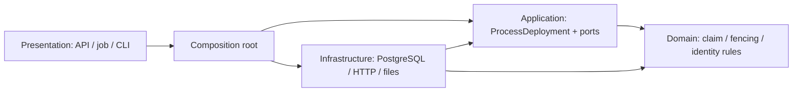

# Dependency directions in the Ruby backend

MESH is a modular monolith with Packwerk, module public APIs and SQL invariants. That is the overall architecture. A service that calls ActiveRecord directly is not a framework-independent Clean Architecture use case.

The external publication execution path now has an explicit clean boundary:

- Domain: plain Ruby, immutable claim data, lease decisions, observation identity and confirmation rules. Stable business error codes carry no HTTP status. No Rails, ActiveRecord, external HTTP client or storage.
- Application: orchestrates atomic claim → read verified bytes / lookup → confirmation. It accepts store, partner, artifact, clock and token dependencies explicitly. It never instantiates infrastructure or opens a database transaction.
- Infrastructure: implements the application ports. PostgreSQL claims/leases and partner-first lock ordering retain their original SQL guarantees. HTTP failures are translated to domain integration failures; Active Storage bytes are bounded and rehashed before publication.
- Presentation: controllers, job and Ruby CLI retain their existing facade. Publishing::Composition wires concrete adapters. The facade returns a Rails read model for compatibility; the independent application itself returns no ActiveRecord object.
- Composition is the deliberate outer-layer dependency on both Application and Infrastructure. HTTP status translation belongs to the outer compatibility facade, not Domain.

Rails autoload roots are app/domain, app/application and app/infrastructure within the Publishing pack. Namespaces are Publishing::Domain, Publishing::Application and Publishing::Infrastructure. Layout follows dependency direction, not just directory names.

`bundle exec ruby script/check_clean_layers.rb` checks Ruby lexer constant references, rejects dynamic dependency escapes and runs a negative control. `bundle exec rspec spec/unit` executes the clean use case without booting Rails or connecting PostgreSQL. Database/concurrency tests still prove the adapter guarantees. Static checking cannot prove every future reflective Ruby trick; review and contract tests remain necessary.

Coverage is explicit: this boundary protects publication execution and its domain rules. Existing marketplace, finance, authorization, validation orchestration and read services remain idiomatic Rails with ActiveRecord coupling. We do not claim the entire repository already has strict Clean Architecture. Further extraction needs a change-pressure reason; creating repository interfaces around every simple CRUD call would add cost without improving this demonstration.

Domain owns invariants and decisions; Application owns a user's workflow; Infrastructure owns mechanisms. Application and Infrastructure are not peers with mutual imports: Infrastructure depends on Application's ports. SQL constraints remain the final guard when another application/SQL client bypasses the use case.
