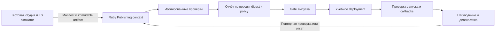

# MESH: маршрут к собеседованию BGaming и дальнейшему инженерному росту

**Приоритет пересмотрен 8 октября 2026 с учётом сообщённого опыта Kubernetes/Docker. Актуальный короткий маршрут — [interview-focus.md](interview-focus.md). Этот документ сохраняет расширенный backlog; прежние P0 и критический маршрут ниже больше не означают обязательный объём до интервью.**

Дата анализа: 8 октября 2026. Статус: **план**. В этой работе изучены критические Ruby-потоки, контроллеры чтения, HTTP-адаптер, конфигурация инфраструктуры и CI, существующие проверки и их отчёты. Новый прикладной код не добавлялся, эксперименты повторно не запускались. Дата собеседования и доступные часы пока неизвестны; порядок задан зависимостями и критериями готовности.

**Главное решение.** MESH уже даёт материал для разговора о сильном Ruby-бэкенде. Следующий шаг — показать полный цикл инженерной ответственности: подключить внешнюю систему, проверить её релиз, безопасно выпустить, заметить пользовательский сбой, установить причину, восстановить сервис и устранить повторение. Именно такой цикл я предлагаю строить поверх существующего проекта.

По [официальной вакансии BGaming](https://bgaming.com/careers/backend-developer-2), роль находится в Publishing и соединяет backend, автоматизацию, интеграции, поддержку студий и SRE. Это основание для выбора направления. Внутренний стек, протоколы и реальные нагрузки BGaming нам неизвестны. Ниже — наш учебный стенд, не реконструкция их платформы. SRE здесь понимается как Site Reliability Engineering; варианты расшифровки из перевода вакансии не используем.

**1. С чего мы действительно начинаем**

Уже есть модульный монолит Rails с доменами identity, talent, marketplace, engagements, finance, notifications, platform; use cases, Pundit, PostgreSQL constraints, зафиксированные условия и версии работ. Есть durable outbox, lease/token-защита обработки, идемпотентность локальных эффектов, финансовая сверка с независимым HTTP-симулятором, карантин файлов и реальный ClamAV. Есть Next.js интерфейс, OpenAPI, RSpec, Playwright, проверки границ, типов и безопасности.

Последние локальные доказательства находятся в [architecture-proofs.md](architecture-proofs.md), [summary.json](evidence/architecture-lab/summary.json) и [verification.json](evidence/architecture-lab/verification.json):

| Проверенное свойство | Полученный результат | Существенная граница |
|---|---|---|
| Регрессия текущего проекта | 94 RSpec без failures/pending; 11 Playwright без skipped/unexpected/flaky | Число тестов не измеряет полноту рисков |
| Чтение большой синтетической выборки | 100 001 проект, 200 001 предложение, 20 000 профилей | Предложения распределены; огромный fanout одного проекта не проверен |
| Оптимизация поиска проектов | Медиана выбранного read case 192,9 → 9,157 мс | Не все запросы; стоимость записи и WAL отдельно не измерена |
| Глубокая cursor-страница | Медиана 26,955 → 4,57 мс; plan buffers 11 848 → 6 | Cursor не создаёт snapshot между страницами |
| Небольшой HTTP read workload | 20 iterations/s, 120 секунд; 2 406 HTTP, p95 81,17 мс | Локальный direct HTTP, без TLS/SSR; не предел мощности |
| Очередь и outbox | Backlog → drain, failed enqueue → recovery, poison event → failed; реальные firing/resolved alerts | Доставка Alertmanager не проверена; общий Docker/Postgres host |
| DB вместе с файлами | Restore в пустую копию, проверка SHA-256, доступа к файлам и восстановления outbox | Один quiescent local drill; не online PITR или offsite recovery |
| Время выбранного восстановления | 74,695 секунды, включая backup и проверки | Один замер; не production RTO |

Сканеры не нашли известных проблем в проверенном scope. Это полезный контроль, но не доказательство отсутствия уязвимостей. Маленькая TLA+ модель, типизация Money и несколько mutation checks также имеют собственные узкие границы.

**Открытые вопросы, которые уже видны в коде:**

- `apps/api/app/controllers/api/v1/projects_controller.rb`: owner `show` материализует все предложения проекта и профили. Нужны отдельная пагинированная выдача и отдельные детали предложения.
- `apps/api/app/controllers/api/v1/engagements_controller.rb`: лимит 40 родительских строк не ограничивает число вложенных submissions, feedback и файлов. Историю и список проектов нужно разделить.
- `apps/api/packs/talent/app/services/talent/directory.rb`: поиск по нескольким полям, skills и имени всё ещё содержит сканирования; после оптимизации проектов его медиана на 20 000 профилей осталась около 80 мс.
- `apps/api/packs/finance/app/services/finance/sandbox_gateway.rb`: адаптер предназначен для HTTP-симулятора. В вызове `Net::HTTP.start` не включён TLS для `https`; нет явных пределов тела ответа, проверки схемы и общего deadline. Для внешнего HTTPS-контракта нужна отдельная доработка и тесты. [Документация Ruby Net::HTTP](https://docs.ruby-lang.org/en/3.4/Net/HTTP.html) различает TLS-настройки и таймаут чтения отдельного блока.
- Download/ZIP пути собирают байты в памяти. Ограничение размера одного файла полезно; расход памяти при параллельных выгрузках ещё не измерен.
- `.github/workflows/verify.yml` существует, но наличие YAML не доказывает успешный удалённый CI. В текущем workspace нет `.git`. Actions указаны тегами; CI/CD promotion, rollback и attestations ещё отсутствуют. Большая reliability lab пока не включена в этот workflow.
- `infra/runtime-role.sql` проверялся отдельно. Нужно реально запустить все роли приложения с ограниченными правами в staging, включая queue и будущие миграции. Локальная схема с общим dev-владельцем не доказывает этот deployment.
- Prometheus вычисляет правила. Ещё нужны доставка сигнала, triage, история пользовательских SLIs, безопасная политика replay и retention failed jobs. Старые failed queue records следует отличать от незавершённого business effect.
- Некоторые ранние документы описывают проверки как planned либо небольшой benchmark, хотя более поздние отчёты уже есть. Нужен единый актуальный каталог доказательств без переписывания исторических результатов.

Итоговая оценка: **сильный локальный прототип с проверенными отдельными гарантиями**. Уровень эксплуатации, релизов и партнёрской поддержки предстоит доказать.

**2. Как каждая часть плана отвечает вакансии**

| Требование | Что уже помогает | Что добавить | Что показать на собеседовании |
|---|---|---|---|
| Ruby backend | Rails use cases, SQL guarantees, concurrency/failure tests | Бounded read API, защищённый HTTP adapter, измеренное профилирование Ruby | Объяснить и изменить конкретный Ruby-поток без подсказок |
| CS и инженерное мышление | Cursor, locks, idempotency, небольшая формальная модель | Разбор сложности, интерливингов и resource budgets | Почему алгоритм корректен, где стоимость и предел |
| Незнакомые системы | Независимый gateway simulator | Независимый partner service с неисправностями и несовместимым контрактом | Найти причину по внешнему симптому, сети и traces |
| Автоматизация Publishing | Локальные scripts и проверки | Ruby CLI, release validator, machine-readable report, release gates | Пакет с дефектом отклонён; исправленный проходит без ручного checklist |
| Интеграции студий | OpenAPI, HTTP/webhook основы | Versioned partner contract, sandbox, примеры запросов, diagnostic bundle | Новая тестовая студия подключается по документации |
| Deployment/production | Hardened production image, readiness | Отдельный Linux staging, настоящий CI/CD, совместимая миграция и rollback | Выпуск и откат идентифицируемого image digest |
| SRE | Очереди, метрики, fault/restore exercises | Пользовательские SLIs/SLO, доставка alerts, incident drills, offsite recovery | Alert → диагностика → mitigation → проверка → postmortem |
| Ownership/RCA | Уже найденные медленные запросы | 3–5 законченных case studies, preventive action и повторная проверка | Доказанная причина вместо списка предположений |
| Работа с DevOps | Конфигурация infra и runbooks | Ясные границы ответственности и handoff с reproducible bundle | Другой инженер продолжает расследование без пересказа |
| Коммуникация со студиями | Пока не подтверждена проектом | RU/EN integration guide, примеры support cases, rehearsals | Коротко объяснить влияние, факты, следующий шаг и ограничения |
| AI-assisted development | Проект создаётся с AI-помощью | Журнал решений AI, отвергнутые советы, независимая проверка | Показать собственное понимание и проверку результата |
| Frontend/несколько языков | Next.js, React, TypeScript | Небольшой операторский интерфейс и TS partner simulator | Проследить проблему от браузера до Ruby и внешней системы |
| 5+ лет коммерческого опыта | Код проекта не подтверждает стаж | Реальные истории из работы, личный вклад и последствия решений | Честный рассказ о коммерческом опыте; никаких выдуманных лет или клиентов |

**3. Что именно строим: MESH Integration & Release Lab**

MESH сохраняет marketplace и рабочую комнату. Добавляем ограниченный Publishing-контекст: внешние студии поставляют цифровой артефакт с manifest и HTTP integration contract. Система проверяет конкретную версию, выпускает её в учебную среду, наблюдает за ней и помогает автору интеграции исправить проблему.

Практический демонстрационный партнёр — маленькое HTML5-приложение с endpoint запуска и callbacks. Его backend можно написать на TypeScript, чтобы получить независимую реализацию и потренировать работу с другой системой. Реальные ставки, RNG-сертификацию и live PSP в этот маршрут не включаем. Отдельный wallet/round simulator допустим позже как упражнение с синтетическими данными; финансы marketplace нельзя выдавать за модель игрового раунда.

Базовая структура: один Rails deployable, существующие Packwerk-границы, один новый Publishing pack с собственным public API. В нём: PartnerIntegration, ContractVersion, ReleaseCandidate, ValidationRun, DeploymentAttempt и аудит действий. Детали назвать окончательно после моделирования; универсальный workflow engine сейчас не нужен. Независимый partner simulator нужен как внешняя граница отказа, а не как повод дробить весь монолит.

Показательные инварианты:

1. Выпускается **тот digest**, который проверялся. Отчёт привязан к contract version, policy version и конфигурации среды; изменение существенного входа требует новых проверок.
2. Одновременные проверки и повторы команды не создают второй релиз. Lease, token и business uniqueness определяют права worker; delivery остаётся at-least-once.
3. Timeout после внешнего принятия операции означает неизвестный исход. Повтор безопасен только в рамках явного idempotency/lookup contract партнёра.
4. Callback не может переписать историю чужого партнёра или старого релиза. Аутентификация, владение, replay policy и допустимые transitions проверяются отдельно.
5. Непроверенный артефакт не запускается внутри Rails process. Даже quarantined файл считается недоверенным; антивирус не заменяет изоляцию выполнения.
6. Откат создаёт новую запись о deployment прежнего digest. История уже произошедших действий сохраняется.

**4. Этапы и критерии завершения**

Приоритет P0 означает обязательную базу до собеседования. P1 существенно усиливает доказательства после базы. P2 — дальний горизонт. Без даты интервью нет честного календарного обещания; этап завершается по результату, а не по числу потраченных дней.

Практики проектирования применяем к конкретным вопросам:

| Практика | Где использовать | Результат и предел |
|---|---|---|
| Короткий Event Storming и context mapping | Подключение студии, проверка и выпуск | Общие термины, события, владельцы решений и trust boundaries; не месяцы моделирования до первого slice |
| State machines и явные инварианты | Release, validation, callbacks, recovery | Таблица transitions, terminal/unknown states и отказные сценарии, привязанные к Ruby/DB tests |
| Vertical slices | Каждый законченный сценарий | Контракт → Ruby → SQL → worker → минимальный UI → evidence; работающая небольшая часть на каждом шаге |
| Ports/adapters на внешних границах | Partner HTTP, scanner, storage | Независимые contract tests и понятные failure modes; обычный AR-код не оборачиваем абстракциями без причины |
| Lightweight RFC и ADR | Изменение ownership, consistency, deployment или storage | Требование, варианты, выбранное решение, цена, обратимость и критерий пересмотра |
| Risk-based testing и architecture fitness | Конкуренция, права, совместимость, границы пакетов | Проверка наиболее дорогих нарушений; механическое количество тестов не цель |
| Threat modeling | Недоверенные endpoints, artifacts и operator actions | Проверяемые misuse cases и контрмеры до открытого доступа |
| SLO, runbook, postmortem | Выпущенная система и support | Пользовательский результат, действия при отказе и проверка профилактики |

Сложность добавляем после измерения или появления нового инварианта. Для каждого существенного решения готовим ответ на три вопроса: «какую проблему решает», «чем платим» и «когда выберем другой вариант».

**Этап E0 · Актуальная карта системы и собственных навыков · P0**

- Сделать текущий evidence index: исходный отчёт, дата, версия кода/образа, среда, инвариант, результат и граница. Существующие локальные результаты не приписывать будущему commit SHA.
- Проверить расхождения README/demo/assurance-plan с поздними отчётами. Старые snapshots сохранить с их датами; актуальное состояние описать в одном месте.
- Подготовить Git-историю дальнейших изменений и проверяемые PR-sized задачи. Перед публикацией провести проверку состава файлов: local secrets, `master.key`, dumps, logs, реальные данные. `.gitignore` уже исключает ряд этих путей, но это не заменяет проверку содержимого публикации.
- Составить карту личного опыта: какие темы можешь объяснить и реализовать самостоятельно, где нужна практика, какие коммерческие истории подтверждают ownership.
- Выбрать один протокол партнёра, одну среду deployment и ресурсный бюджет. Зафиксировать scope первого законченного demo.

Готово, когда на любое утверждение «это работает» есть ссылка на конкретную проверку с границами, а backlog отличает done от planned. Артефакт: evidence index + одностраничный design brief + исходный список личных пробелов.

**Этап E1 · Реальные границы Ruby-бэкенда · P0**

- Разделить project details, список proposals и proposal details. Cursor pagination, server-side filters/sorts, ограниченные previews; сравнение авторов запрашивает явно выбранные ID.
- Сделать такой же bounded контракт для списка engagements и истории versions/feedback/files. Лимит родительских объектов и лимиты детей задаются независимо.
- Создать hot project с 10 000 предложений и engagement с длинной историей. Проверить access policy, устойчивую сортировку с ties, query count, JSON bytes, allocations и RSS. Первые проектные budgets: максимум 50 предложений на страницу и фиксированная верхняя граница preview; SELECT не растут линейно с числом строк страницы. Конкретный лимит времени калибровать на выбранном host.
- Доработать внешний HTTP adapter: HTTPS с проверкой сертификата, open/read/write и общий budget, ограничение тела/сложности ответа, Content-Type/schema, безопасные ошибки, redaction, понятное поведение на 404/429/5xx и разрывах соединения. Не добавлять универсальный retry на все ошибки.
- Прогнать timeout до принятия, timeout после принятия, invalid JSON, неверную схему, oversized body, неправильный сертификат, медленный поток и истёкшую idempotency key. Slow trickle не должен бесконечно продлевать общий deadline.
- Измерить файлы/архивы при параллельной работе. Если память растёт неприемлемо — streaming или асинхронный export с временным артефактом, квотами и cleanup; выбрать по результату.
- Поиск авторов оптимизировать после profiling и проверки семантики. Если нужен search document, определить владельца, обновление имени/skills, backfill, rebuild, reconciliation и допустимое отставание. Elasticsearch не нужен для самого факта поиска.

Готово, когда объём ответа и расход ресурсов ограничены контрактом, ошибочный партнёр не захватывает worker надолго, а before/after сравнение воспроизводимо. Артефакты: request/contract/concurrency tests, профили CPU/allocations, SQL plans и ADR с ценой решения. Изменения API сопровождаются обновлённым frontend/OpenAPI.

**Этап E2 · Настоящий путь выпуска · P0**

- Поднять отдельный Linux staging с TLS и реалистичной production конфигурацией. Выбрать один способ provisioning и deployment: для начала достаточно VM, declarative configuration и контейнеров. Облачный провайдер и платные ресурсы выбираются по доступу и бюджету при реализации.
- API, worker, dispatcher, scanner, primary/queue DB должны иметь явные ресурсные лимиты и сети. Отделить runtime, migration и backup credentials. Доказать права реальным boot, workflow и запрещёнными SQL действиями, включая новые таблицы после миграции.
- Запустить существующие проверки в удалённом CI. Зафиксировать actions commit SHA, минимальные permissions и происхождение артефактов. Быстрые проверки идут на PR; тяжёлая load/restore lab — отдельный явно запускаемый или впоследствии периодический job.
- Build один раз, идентифицировать image digest, провести staging smoke и продвигать тот же образ. Добавить release record: commit, digest, конфигурационная версия, migrations, результаты проверок, actor и timestamps.
- Настроить health/readiness, graceful termination, остановку приёма новых jobs и правила draining. Выпуск одного environment сериализован.
- Первым упражнением сделать обычный rolling либо blue/green выпуск и реальный откат сломанной версии. Canary добавить следующим шагом, когда есть два варианта сервиса и измеряемый сигнал.
- Проверить expand → backfill → contract миграцию при продолжающихся writes: old/new API и workers совместимы с промежуточной схемой, backfill resumable/bounded, lock/WAL рост измерен. Destructive schema change нельзя считать обратимым только потому, что старый image доступен.

[GitHub deployment environments](https://docs.github.com/en/actions/concepts/workflows-and-actions/deployment-environments) предоставляют gates и ограничения доступа; доступность конкретных правил зависит от repository/account. [Artifact attestations](https://docs.github.com/en/actions/concepts/security/artifact-attestations) связывают происхождение сборки с её идентичностью. Это отдельные механизмы: происхождение образа само по себе не подтверждает его корректность.

Готово, когда новая машина поднимается по инструкции, CI действительно прошёл, сломанный выпуск откатывается, а приложение проходит business smoke под runtime role. Артефакты: deployment manifest, CI run, release/rollback report и compatibility test. Staging остаётся staging, даже если использует production image.

**Этап E3 · Подключение студии и автоматическая проверка релиза · P0**

- Написать versioned OpenAPI/manifest contract и короткий EN quickstart. Подготовить минимальный TS simulator с отдельным состоянием и управляемыми отказами. Партнёр не должен импортировать наши ActiveRecord модели.
- Ввести scoped partner credentials и их rotation/revocation; для первого slice достаточно одного прозрачного механизма. Проверить попытки читать, публиковать и replay чужие releases.
- Ruby CLI с понятными exit codes и JSON output: validate manifest, проверить endpoint, отправить candidate, получить report. Команды должны быть повторяемыми, иметь deadlines и не печатать secrets. Названия CLI окончательно выбрать при реализации.
- Validator проверяет schema, обязательные файлы, digest, contract compatibility, TLS/auth, правильный launch/callback journey и выбранные resource limits. Ошибка получает stable code, observed/expected и совет по исправлению.
- Архивы: ограничить compressed/uncompressed bytes, entries, глубину и время; запретить path traversal и небезопасные ссылки. Если действительно выполняем чужой код, выносить в отдельный sandbox с политикой network/CPU/memory/time; обычный Docker container не объявлять достаточной изоляцией произвольного злонамеренного кода.
- Привязать report к immutable inputs. Повторная загрузка, смена контракта, политики или существенной конфигурации делает прежний результат непригодным для gate.
- Реализовать маленький lifecycle candidate → validating → ready/rejected → staging → released/rolled_back. Для deployment с неизвестным исходом нужен отдельный явный статус и сверка. Concurrent publish, устаревший worker и повтор callback покрыть настоящими DB тестами.
- Добавить три небольших рабочих экрана: integration status, validation report, release history. Основное усилие остаётся в Ruby и проверяемом процессе.

Готово, когда тестовая студия подключается по guide, несколько дефектных candidates отклоняются по правильным причинам, исправленный digest проходит gate, повтор не создаёт второй deployment и каждый отказ можно расследовать. Артефакты: CLI transcript, report JSON, contract tests, release audit и end-to-end demo. Это техническая проверка выбранного контракта, не сертификация реальной iGaming-игры.

**Этап E4 · Наблюдение, поддержка партнёров и первый инцидент · P0**

- Определить пользовательские journeys: открытие брифа, отправка предложения, доступ к версии; для Publishing — успешный launch, обработка callback и завершение проверки candidate.
- SLIs считают результат journey, а не только HTTP 200. Для async работы важны completion delay и terminal outcome. Denominator, intentional rejection, maintenance и отсутствие событий описать явно.
- Предложить SLO отдельно от достигнутой истории. Исходная гипотеза для одного read journey: 99,9% успешных валидных запросов за 30 дней при объявленных условиях; latency budget определить по baseline. Если реального трафика мало, показывать synthetic checks отдельно и не создавать статистику из отсутствия запросов. Денежные и ownership инварианты не имеют «разрешённого бюджета нарушений».
- Добавить app/DB/queue/network/release dashboards: p95/p99, errors, pool wait, lock wait, oldest ready/outbox age, failed business states, validation age, partner outcome и deployed digest. Метрики не содержат неограниченных labels с operation/user IDs; подробности находятся в logs/traces.
- Проверить propagation correlation/trace через HTTP → use case → outbox → worker → partner callback. Добавить диагностический поиск по operation/release ID с контролем доступа и redaction.
- Подключить Alertmanager к контролируемому тестовому receiver. Проверить firing, resolved, grouping, silence и отсутствие лавины повторов. Для внешних каналов выбрать адресата и способ доставки при реализации.
- Для достаточного объёма запросов добавить multiwindow burn-rate alerts. При малом трафике отдельно калибровать простой synthetic сигнал и ручной triage. Каждый alert имеет impact, owner, urgency и runbook. [Google SRE](https://sre.google/workbook/alerting-on-slos/) объясняет связь алертов с расходом error budget; готовые пороги нельзя без проверки переносить на низкую нагрузку.
- Сделать support bundle: версия integration/release, sanitized request sample, timings, trace link, known facts, reproduce command и next action. Реализовать readonly Ruby diagnostic command; опасный replay всегда scoped, previewable и audited.
- Закончить один incident drill: симптом партнёра → локализация → mitigation → исправление → проверка повторения → RU/EN incident note. Нельзя называть внедрённый failpoint реальным production incident.

Готово, когда из сбоя появляется доставленный и полезный сигнал, другой человек может продолжить диагностику по bundle, а исправление подтверждено regression test. Артефакты: timeline, alert receipt, trace, runbook и postmortem. [Подход Google SRE к postmortems](https://sre.google/sre-book/postmortem-culture/) полезен для разбора условий отказа и профилактики без поиска виноватого.

**Этап E5 · Нагрузка, Ruby performance и отказные сценарии · P1**

- Расширить dataset: обычные/популярные слова, короткие query без полезных триграмм, 10 000 proposals одного проекта, длинные версии, разные размеры файлов, tenant skew. Количество строк без распределения не описывает сложность workload.
- Выделить read, write, integration, file и async workloads. Стартовать с известного baseline; ступенчато повышать нагрузку, например 20 → 50 → 100 requests/s, затем выше по результату. Цифры — контрольные точки эксперимента, не обещанная мощность.
- Измерять не только p95: p99, ошибки/conflicts, dropped iterations, очередь, CPU/RSS, allocations/GC, SQL buffers/IO, locks, connection pool, network и storage. Фиксировать warm/cold режим, hardware, версии, seed, commit/digest и длительность.
- Провести steady state/soak 30–60 минут и controlled burst. Проверить drain после burst и отсутствие накопления RSS; устойчивость одного короткого теста не приравнивать к долгой работе.
- Сделать один законченный Ruby performance case: profiler показывает причину → изменение → те же данные и workload → сравнение latency/allocations/CPU → объяснение trade-off. Для GC использовать, например, [GC.stat Ruby 3.4](https://docs.ruby-lang.org/en/3.4/GC.html); цифры RSS дополнить, не заменять ими GC telemetry.
- Рассчитать суммарные DB connections по процессам API/worker/dispatcher и по primary/queue pools. Экспериментально показать pool saturation; просто увеличить `RAILS_MAX_THREADS` недостаточно.
- Провести controlled faults только на отдельном стенде: worker kill после commit до ack, медленный/недоступный partner, потерянный ответ после принятия, poison payload, исчерпание выделенного дискового тома, DB lock contention, несовместимый release и потеря webhook.
- Для каждого drill заранее определить инвариант, допустимую деградацию, abort condition и способ cleanup. Эксперимент завершён после восстановления и бизнес-проверки, а не после появления ошибки.
- Добавить property/state-machine tests для выбранных последовательностей retry/restart/callback; сохранять seed. Mutation testing расширять на несколько рискованных guards, разбирая выжившие mutations, а не стремясь к числу ради числа.

Готово, когда есть capacity envelope для объявленного workload, хотя бы один измеренный bottleneck исправлен, границы деградации понятны и faults не создают второй business effect. Артефакты: raw measurements, before/after, failure reports, стоимость ресурсов и пересмотренные budgets.

**Этап E6 · Backup, online recovery и согласованность файлов · P1**

- Сохранить нынешний quiescent DB/files drill как простую известную стратегию. Следующим добавить physical base backup + continuous WAL archive для online PITR. `pg_dump` не является base backup для WAL replay; это прямо разделено в [PostgreSQL 18](https://www.postgresql.org/docs/18/continuous-archiving.html).
- Хранить encrypted backup вне исходного host и проверить доступность ключей при потере host. Определить retention, deletion, стоимость и процедуру проверки архива WAL.
- Перейти в лаборатории к versioned object storage либо протоколу immutable keys с retention. DB restore point и набор файлов связываются inventory/manifest; база не должна ссылаться на отсутствующий или другой object version. Очистка storage учитывает допустимое окно восстановления.
- Восстановить на втором чистом host/окружении: DB, ссылки и реальные bytes файлов, приложение под runtime role, private downloads, outbox и все выбранные recoverable job classes.
- При restore явно задать read-only/maintenance режим, запрет financial dispatch и правила reconciliation с внешней системой. Внешнее состояние нельзя откатить вместе с нашей DB. Idempotency TTL и операции после restore point требуют отдельного решения.
- Негативные случаи: missing WAL, повреждённый object, недоступный encryption key, истёкшие external idempotency keys, несоответствие provider/local state. Невалидную копию не объявлять восстановленной по одному успешному `/ready`.
- Для маленького staging предложить начальные цели RPO ≤ 60 секунд и RTO ≤ 15 минут; подтвердить либо пересмотреть их в ADR. RPO измеряется по известным acknowledged writes и выбранной точке восстановления, включая пределы файлов; RTO — от объявления восстановления до полной проверки сервиса. Выполнить минимум три независимых drills.

Готово, когда другой инженер по runbook восстанавливает систему без исходного host и личных догадок, а файлы и внешние эффекты проверены. Артефакты: restore inventory, timings нескольких прогонов, negative reports, runbook и стоимость backup/retention.

**Этап E7 · Безопасность интеграций и supply chain · P1, необходимые защиты включаются уже в E2–E3**

- Threat model для partner credentials, endpoints, artifacts, webhook, operator actions, logs и exports. Trust boundaries, владельцы рисков, misuse cases и проверяемые ограничения.
- SSRF: allowlisted destinations/ports, политика redirects, DNS/IP validation и фактические network restrictions. Проверить localhost/private/link-local destinations в собственном стенде. Одной проверки строки URL недостаточно.
- Auth: cross-partner access, scoped keys, revocation/rotation, replay windows, clock skew, подпись исходных webhook bytes и выбранная история key versions. Не выводить secrets в traces или диагностический bundle.
- Input/resource security: body/JSON depth/archive limits, quotas на partner, time/concurrency budgets, минимальные privileges validator. Для скачиваний проверить headers, ownership и срок доступа.
- Delivery security: pinned dependencies/actions, SBOM, известные CVE с triage, image provenance и проверка digest перед deploy. Где выбранная платформа поддерживает — short-lived CI credentials/OIDC вместо постоянных широких ключей.
- Сравнить фактические runtime permissions с policy после каждой schema migration. Новая immutable table не должна случайно получить широкие default DML grants.
- Проверить retention/audit: терминальные failed jobs, orphan artifacts, audit tamper boundaries, PII в logs и безопасное удаление. Append-only triggers не защищают от администратора DB или изменяемого storage автоматически.

Матрица рисков опирается, в частности, на [OWASP API Security Top 10](https://api-security.owasp.org/editions/2023/en/0x11-t10/): владение объектами, resource consumption, SSRF и недоверие к входам сторонних API особенно важны для этой лаборатории. Проверки подтверждают выбранную модель угроз, а не формальный статус «безопасно всё».

Готово, когда ключевые злоупотребления воспроизводимо отклоняются, выявленные риски исправлены либо явно приняты с границей, а секреты/артефакты выпуска проверены. Артефакты: threat model, negative tests, triage notes и release evidence.

**Этап E8 · Личная подготовка инженера · P0, идёт параллельно всем этапам**

Качественный репозиторий полезен, если можешь защищать решения и работать с ними самостоятельно. Каждую неделю нужна практика четырёх типов:

| Направление | Упражнение на MESH | Проверка личной готовности |
|---|---|---|
| Ruby | Enumerators/lazy collections, exceptions/ensure, immutable values, threads/processes, profiling allocations/GC | Написать bounded parser/HTTP command и объяснить cleanup/error paths |
| Rails/SQL | AR eager loading, transactions, callbacks, SQL isolation, locks, deadlocks, indexes, migrations | Предсказать SQL, найти гонку, воспроизвести её двумя connections и исправить |
| CS | Hash/queue/heap, сложность поиска и очереди, ordering, fairness, backpressure | Обосновать структуру данных, bounds и поведение при перегрузке |
| Сеть/Linux | DNS, TLS, HTTP, ports, processes, disk, permissions, container networking | Локализовать один неизвестный integration failure по наблюдениям |
| System design | Release validation, callback ingestion, private storage, rollback, DR | За 45 минут уточнить требования, предложить простое решение и назвать пределы |
| AI | Ограниченная задача, explicit assumptions, diff review, независимый test/measurement | Объяснить принятую и отвергнутую подсказку; самостоятельно изменить решение |
| Английский | Integration support, incident update, architecture trade-off | 5 минут рассказа, 10 минут уточнений, короткое письмо без потери смысла |

Проводить 45–60 минут самостоятельной работы без AI: небольшой Ruby coding task или диагностика неизвестного дефекта. Затем отдельно разобрать, где AI ускорил работу и где ввёл в заблуждение. В AI journal записывать задачу, входы без secrets, совет, собственное решение и проверку; токены и объём сгенерированного кода не измеряют инженерную ценность.

Подготовить 5–7 правдивых историй из коммерческой работы: сложный баг, инцидент, спор о trade-off, улучшение процесса, поддержка чужой команды, ошибка и её исправление. Для каждого: контекст, личная ответственность, факты, решение, измеренный результат, что сделал бы иначе. Лабораторные drills подписывать отдельно; проект не создаёт 5 лет коммерческого опыта.

Готово, когда объясняешь основные механизмы без чтения документов, решаешь ограниченную задачу самостоятельно и отвечаешь на «что будет, если…» с конкретными состояниями и проверками. Репетиции должны выявлять пробелы, а не запоминать красивый текст.

**Этап E9 · Пакет для собеседования · P0, готовится с первого этапа**

- EN README с quickstart и ограничениями; одностраничная архитектура; несколько ADR с альтернативами и стоимостью; evidence index с commit/digest для новых результатов.
- 3–5 инженерных case studies: SQL/cursor optimization; timeout после внешнего принятия; ошибочный release и rollback; worker/replay; DB/files recovery. Для каждой — symptom, investigation, root cause, fix, verification, boundary.
- 15–20-минутное demo. Студия приносит плохой candidate → validator объясняет отказ → исправленный candidate проходит → release запускается → controlled сбой обнаруживается → support bundle приводит к причине → выполняется mitigation/rollback → regression check подтверждает исправление.
- Отдельная 5-минутная версия: задача, одна гарантия, один failure, одно измерение, одна граница. Не пытаться показывать все экраны и инструменты.
- Видео и screenshots как резерв, с датой/версией и указанием записи. В live demo не подменять неудачную работу старым видео без пояснения.
- Три mock interviews: Ruby/SQL; диагностика и system design; английский/support. Вопросы должны включать незнакомые условия, а не только выученные MESH решения.
- CV bullets использовать только из реально полученных фактов. Пример допустимого типа: «На локальном synthetic workload 100k projects оптимизировал выбранный поиск 192,9 → 9,16 мс; сохранил семантику и описал write/index trade-off». Не превращать это в production throughput или реальный клиентский SLA.

Готово, когда интервьюер может проверить главные заявления, demo воспроизводится на чистой среде, а ты объясняешь решения и ограничения без помощи AI.

**5. Дальний горизонт: высокая планка после первого полного цикла · P2**

Это backlog роста. Задачи добавляются по изменившемуся риску и проверяемому эффекту; выполнение всего списка не требуется, чтобы идти на интервью.

| Направление | Условие, при котором имеет смысл | Как доказать результат |
|---|---|---|
| Canary с автоматическим rollback | Есть минимум два deployment варианта и достоверный health/user signal | Частичный трафик на bad release, остановка promotion и восстановление; при низком трафике documented inconclusive outcome |
| Multi-instance API/worker | Single instance уже стал пределом либо нужен recovery при process failure | Balancing/draining, общий auth budget, stale worker fencing, совместимый rollout |
| DB replica/failover | Есть требование recovery, чтения либо maintenance, которому single node не отвечает | Replica lag, promotion, отсутствие двух writers, ограничения stale reads и измерение потерь |
| Contract compatibility matrix | Партнёры используют несколько поддерживаемых версий | Old/new consumer/provider fixtures, deprecation policy и release gate |
| Per-partner isolation | Один партнёр влияет на latency/queue других | Квоты, bounded concurrency, очереди или bulkheads; нагрузка noisy neighbor не разрушает согласованный budget |
| Distributed workflow | Release process стал долгим и пересекает реальные внешние boundaries | Recovery после каждого шага, явные compensations, отсутствие unsafe replay |
| Формальная модель release/idempotency | Существуют сложные interleavings и явные assumptions | Маленькая TLA+/PlusCal модель, mapping в Ruby tests, counterexample и bounds; не «доказан весь backend» |
| Property/model-based testing | Ручные сценарии не покрывают порядок callbacks/retry | Генератор с seeds и простой независимой reference model, воспроизводимые найденные дефекты |
| Оптимизация Ruby runtime | Profiling показывает CPU/allocations/IO bottleneck | Сравнить процессы/threads и, если оправдано, другой IO execution strategy на том же workload |
| Public SDK/diagnostic toolkit | Он сокращает измеренное время интеграции | Новая тестовая студия проходит quickstart, измерены шаги/время до и после, ошибки диагностируются |
| Failure recovery на другом host | Local drills готовы; budget допускает отдельные ресурсы | Потеря исходного host, offsite restore, external reconciliation, подтверждённые RPO/RTO |
| Несколько регионов | Есть конкретная потребность географии/DR и ресурсы сопровождения | Latency/consistency/failover модель, измеренная цена и ограничение split-brain; последний этап, не старт |

Kubernetes, Kafka, микросервисы, CQRS/event sourcing, отдельный search cluster и тотальная типизация могут быть вариантами решения. Каждый требует проблемы, альтернативы и стоимости сопровождения. Сам факт добавления технологии не закрывает пункт вакансии. Прежде чем менять монолит, нужно доказать, что его предел действительно мешает выбранной цели.

**6. Порядок backlog и текущий статус**

Все строки ниже **planned**. Done — только существующий baseline из раздела 1; он не распространяется на новые модули или deployment.

| ID | Приоритет | Задача | Зависимость | Проверяемый результат |
|---|---|---|---|---|
| R01 | P0 | Evidence index и устранение doc drift | Baseline | У каждого claim есть дата/scope/source |
| R02 | P0 | Git/publication readiness и local secret audit | R01 | Проверен состав будущей публикации; история новых изменений |
| R03 | P0 | Личный Ruby/SQL/English baseline и реальные career stories | Нет | Пробелы зафиксированы; первый mock interview |
| R04 | P0 | Proposal list/details API и UI pagination | R01 | Hot project 10k; bounded payload; access/cursor tests |
| R05 | P0 | Bounded engagement/version/history API | R04 | Длинная история не загружается целиком |
| R06 | P0 | HTTPS и bounded partner HTTP adapter | R01 | TLS/slow body/schema/timeout contract tests |
| R07 | P1 | Creator search profile и решение о search document | R04 | Semantic equivalence, latency/size/write-cost report |
| R08 | P1 | Parallel download/export memory study | R05 | Измеренный RSS и выбранный budget/export approach |
| R09 | P0 | Linux staging и runtime/migration/queue roles | R02, R06 | Business smoke и запрет SQL под реальными credentials |
| R10 | P0 | Удалённый CI и immutable build identity | R02 | Реальный успешный run и привязанные новые evidence |
| R11 | P0 | Deployment и rollback одного digest | R09, R10 | Bad image rollback; private file/workflow smoke |
| R12 | P0 | Совместимая schema/job migration | R11 | Old/new работают во время writes и draining |
| R13 | P0 | Partner contract, threat model и TS simulator | R06 | Versioned contract, fixtures и controlled faults |
| R14 | P0 | Ruby validation CLI и report format | R13 | Correct exit codes, redaction, actionable errors |
| R15 | P0 | Artifact input/resource protections | R13, R14 | Digest/limits/traversal/ownership negative tests |
| R16 | P0 | Durable validation и release lifecycle | R12, R15 | Idempotency, stale worker, changed input, audit tests |
| R17 | P0 | Integration/report/release operator screens | R16 | Полный реальный workflow через Ruby |
| R18 | P0 | Correlation и diagnostic bundle | R16 | HTTP → worker → callback trace и sanitized export |
| R19 | P0 | SLIs/SLO proposal и end-to-end probes | R11, R16 | Явные denominators; honest synthetic/real distinction |
| R20 | P0 | Alertmanager delivery и runbooks | R18, R19 | Firing/resolved дошли до test receiver |
| R21 | P0 | Законченный integration incident drill | R20 | Mitigation, RCA, fix, retest и EN update |
| R22 | P1 | Writes/skew/files нагрузка и soak | R04, R05, R09, R16 | Capacity envelope и resource evidence |
| R23 | P1 | Ruby profiling и оптимизация по причине | R22 | Before/after на одном workload |
| R24 | P1 | Crash/network/disk/lock experiments | R21, R22 | Invariants, degradation, recovery и cleanup |
| R25 | P1 | Properties/mutations выбранных transitions | R16, R24 | Seeds, surviving mutants и fixes |
| R26 | P1 | Physical backup/WAL и offsite storage | R09 | Успешная проверка архива и missing-WAL negative case |
| R27 | P1 | Versioned file storage и restore manifest | R15, R26 | DB point ссылается на правильные object versions |
| R28 | P1 | Restore на чистом host + reconciliation | R24, R27 | Три drills, private download, RPO/RTO и external-state boundaries |
| R29 | P1 | Supply-chain/security review | R10, R13, R16 | SBOM/provenance/credentials/SSRF/quota evidence |
| R30 | P1 | Failed jobs/artifacts/logs retention и безопасный replay | R18, R24 | История отделена от незавершённых эффектов; audited recovery |
| R31 | P0 | EN quickstart и support handoff rehearsal | R14, R18 | Человек подключается и диагностирует по guide |
| R32 | P0 | Interview package, demo и три mock interviews | R03, R11, R17, R21, R31 | Проверяемые claims и самостоятельная защита |
| R33 | P2 | Canary, multi-instance, failover и другие stretch задачи | Соответствующие доказанные P0/P1 | Новый риск/предел, experiment, стоимость и решение |

Критический маршрут первого законченного цикла: **R01/R02 → R04–R06 → R09–R17 → R18–R21 → R31/R32**. Личная подготовка R03 и фиксация материалов для demo идут с первого дня. Поиск авторов, масштабная нагрузка и PITR не должны бесконечно задерживать первый завершённый integration/release/support journey; они усиливают следующий уровень.

**7. Как двигаться постоянно и не утонуть в плане**

Работаем короткими завершёнными пакетами. Один пакет: проблема → критерий/инвариант → ограниченное изменение → нужные проверки → raw evidence → объяснение trade-off → короткое EN demo. Одновременно держать не больше одного основного backend изменения и одной учебной темы.

Каждая новая задача получает ID, исходный симптом/риск, scope, dependency, budget, acceptance criteria, evidence path и status. Status progression: planned → in progress → verified; blocked требует конкретной отсутствующей зависимости. «Код написан» не равен verified. Findings могут менять приоритеты и отменять ненужные задачи.

После каждого законченного пакета обновляем evidence index, backlog и demo. На простой правке не повторяем все load/restore exercises; проверяем риски изменения. Большие reliability эксперименты нужны после изменений очередей, storage, migration, adapter или failure model.

Три уровня готовности:

- **Первый сильный разговор:** текущий baseline, устранённые важные bounded-read/HTTP границы, самостоятельное объяснение Ruby/SQL, честные коммерческие истории и короткий demo. Можно идти на собеседование, продолжая работу.
- **Целевой пакет под эту вакансию:** реальные CI/deploy/rollback, partner contract + validator + release gate, delivered alert и законченный support/incident drill, EN guide и самостоятельная защита. Это приоритет P0.
- **Продвинутый пакет:** измеренная смешанная нагрузка и Ruby profiling, online/offsite recovery DB/files, security evidence и 3–5 законченных case studies. Затем продолжается P2.

Если интервью скоро, сужаем scope до одного партнёра, одного артефакта, одного deployment и одного failure; сохраняем целый жизненный цикл. Если времени много, углубляем тот же цикл до performance, DR и fault isolation. Не обещаем сроки, пока не известны доступные часы и исходный уровень самостоятельной работы.

**8. Вопросы, которыми уточнить реальную роль**

На интервью выяснить: какие integration protocols и Ruby stack используют; что именно Publishing выпускает и проверяет; где больше всего ручной работы; как разделены обязанности с DevOps/security; кто отвечает за on-call и какие существуют SLO; какие инциденты повторяются; как устроены sandbox/contract versions; как оценивают первые 90 дней; каков разрешённый scope AI-инструментов. Эти ответы уточнят план лучше, чем предположения об их внутренней архитектуре.

Ожидаемый результат маршрута: ты можешь показать работающую систему, установить причину неисправности, восстановить выбранный сценарий и объяснить каждый существенный компромисс. Решение о найме зависит также от коммерческого опыта и личного разговора; размер репозитория и количество технологий его не заменяют.

Ближайший пакет после принятия направления: **R01 + design brief R13, затем R04 и R06**. Сначала фиксируем проверяемую основу и реальный контракт; далее исправляем найденные границы чтения и HTTP, чтобы последующая лаборатория опиралась на понятный Ruby backend.
