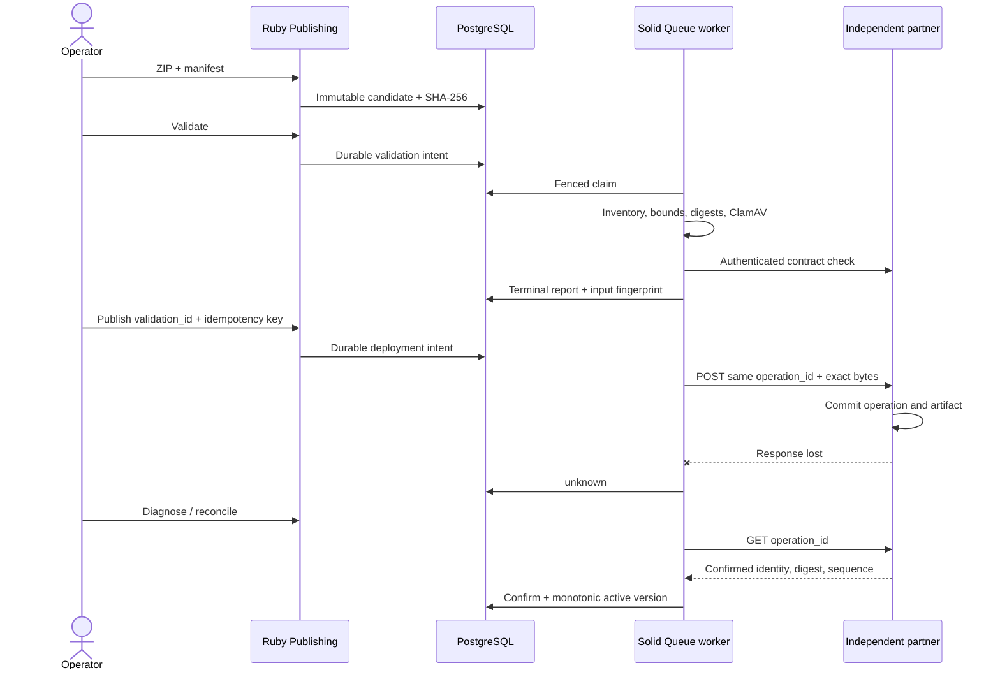

# MESH Integration & Release Lab

Publishing — отдельный Ruby-контекст в modular monolith. Оператор принимает пакет внешней студии, получает воспроизводимый отчёт, выпускает проверенные байты и расследует неопределённый результат. TypeScript simulator работает отдельным процессом и хранит принятые пакеты в SQLite/WAL. Загруженный HTML не исполняется.



## Локальный запуск

Все команды выполняются из MESH-showcase. Docker Desktop должен работать; Node.js 22 и npm нужны на host. Первая сборка требует доступа к официальным registry и памяти для ClamAV. На тесном host production-release, Kubernetes и preview выполняются последовательно.

```powershell
npm run demo
```

Команда сохраняет существующие credentials и данные, применяет миграции, идемпотентно добавляет synthetic accounts, запускает настоящий scanner, обычные dispatcher/worker, partner и dashboard. Выполняет CLI drill и четыре browser checks. Отчёты — .cache/interview-demo/<timestamp>. Она не удаляет volumes и не покупает ресурсы. Interview mode заранее загружает Ruby-код и отключает development auto-reload; после изменения исходников нужно перезапустить API/worker/dispatcher. Это локальный стенд с development environment, а отдельный HTTPS release проверяет production runtime.

Вход: [Publishing](http://localhost:3200/publishing), [Grafana](http://localhost:32092/d/mesh-reliability). Synthetic operator: ops@mesh.local / MeshDemo2026!. Это только демонстрационная учётная запись. Другие пользователи не получают operator rights автоматически.

Отдельные упражнения:

```powershell
npm run demo:publishing
npm run demo:incident
```

CLI исполняется в Ruby-контейнере:

```powershell
docker compose exec -T -e MESH_DEMO_PASSWORD=MeshDemo2026! api ruby bin/mesh-publish list
docker compose exec -T -e MESH_DEMO_PASSWORD=MeshDemo2026! api ruby bin/mesh-publish diagnose OPERATION_UUID
docker compose exec -T -e MESH_DEMO_PASSWORD=MeshDemo2026! api ruby bin/mesh-publish reconcile OPERATION_UUID
```

Demo fixtures создаются в .cache/publishing-fixtures. Bad manifest содержит неверный file digest. Good v1 и v2 передаются обычным API с реальным ZIP; секретный partner token в manifest не входит. CLI использует login/session/CSRF, а не доступ к SQL.

## Что именно проверено

[Полный CLI сценарий](evidence/publishing-repeatable-demo-final/publishing-demo/summary.json): defective candidate отклонён и не опубликован; v1 подтверждена; v2 принята партнёром, но локально стала unknown; lookup восстановил подтверждение; rollback вернул v1. Ровно три remote publish requests соответствуют двум выпускам и одному rollback. Для каждого файла проверен SHA-256 через приватный authenticated download. Три настоящих signed callbacks доставлены с HTTP 200; поздний callback не меняет результат rollback.

[118 RSpec examples в native Alpine runtime](evidence/publishing-rspec-alpine.json) проверяют concurrency/idempotency, database constraints, stale validation, callbacks/replay, multipart budget и настоящий TCP/TLS клиент. Это весь suite, не 118 новых Publishing-тестов. [Повторяемый browser/demo run](evidence/publishing-repeatable-demo-final/summary.json) содержит exit codes и длительность каждой стадии.

## Гарантии и их цена

| Гарантия                                               | Механизм                                                                                                                   | Стоимость и граница                                                                                                                                                                                                                                |
| ------------------------------------------------------ | -------------------------------------------------------------------------------------------------------------------------- | -------------------------------------------------------------------------------------------------------------------------------------------------------------------------------------------------------------------------------------------------- |
| Проверен конкретный пакет                              | Immutable candidate, exact artifact/manifest SHA, terminal report, versioned policy                                        | Metadata хранится в primary DB, bytes — приватный Active Storage volume; предел 2 MB. Upload и SQL не образуют распределённую transaction: при отказе возможен orphan blob; нужен lifecycle/cleanup. Для больших пакетов — durable object storage. |
| Условия проверки не потеряны                           | Fingerprint связывает local contract version, policy, approved origins, credential, CA и environment generation            | Смена remote правил должна сопровождаться contract version. Default system trust store требует bump environment generation; custom CA content хешируется                                                                                           |
| Дефект нельзя выпустить                                | Passed validation, candidate binding и актуальный fingerprint перед dispatch                                               | Условия перепроверяются перед POST, но невозможно атомарно заморозить чужую систему                                                                                                                                                                |
| Одновременные команды не создают второй publish intent | PostgreSQL unique index + Platform::Idempotency + row lock                                                                 | Это локальная гарантия. Партнёр также обязан соблюдать operation-id contract                                                                                                                                                                       |
| Worker crash не теряет intent                          | Durable rows, leases, claim tokens, dispatcher                                                                             | Несколько SQL операций и периодический polling. Потеря lease после начала I/O ведёт к lookup                                                                                                                                                       |
| Потерянный ответ не вызывает второй POST               | pending → dispatching → unknown → GET lookup                                                                               | Если партнёр не умеет lookup или потерял свою историю, автоматического безопасного завершения нет                                                                                                                                                  |
| Старый callback не откатывает активную версию          | Signed raw-body receipt, unique event ID, identity/digest match, monotonic partner sequence                                | Нужны согласованные часы и sequence contract; это не Byzantine consensus                                                                                                                                                                           |
| История не переписывается runtime                      | SQL triggers, composite foreign keys, ограниченные grants                                                                  | DB owner имеет административные полномочия; audit не является внешне подписанным tamper-proof журналом                                                                                                                                             |
| HTTP I/O ограничен                                     | TLS VERIFY_PEER, 2s open/read/write, 5s overall I/O, 64 KiB streamed JSON response, no redirects/retries/proxy inheritance | Общий бюджет охватывает сетевой блок. Формирование запроса и локальная обработка отдельно; Ruby Timeout допустим только в изолированном блоке без SQL transaction                                                                                  |
| ZIP не превращается в произвольную запись файлов       | 16 regular entries, safe paths, exact inventory/SHA, 2 MB expanded, 3s budget, без extraction, ClamAV                      | Проверка структуры/известных сигнатур не доказывает безопасность исполняемого кода                                                                                                                                                                 |

unknown — честное состояние неопределённости. Даже локальный preflight failure может оставить его для консервативной диагностики. lookup 404 не превращается в разрешение повторить POST. attempts считает обработку/lookup, а не число удалённых POST.

Rollback — новая удалённая операция на ранее подтверждённые байты с новой sequence. Это не rollback SQL/schema. Use case проверяет confirmed matching basis; SQL не объявляется полноценным доказательством всех бизнес-правил rollback.

## Код для разговора

- packs/publishing: PackageValidator, ValidateCandidate, RequestDeployment, ProcessDeployment, ApplyObservation, ReceiveCallback.
- packs/platform: HttpClient, Idempotency, Metrics, Events.
- DB migrations: immutable history, provenance foreign keys и latest-validation index.
- bin/mesh-publish: bounded, authenticated diagnostic CLI.
- apps/partner/src: независимый контракт и durable uncertain-outcome simulator.
- contracts/openapi.json: 51 operations; frontend получает generated types.

Machine callback — stateless ActionController::API: raw-body HMAC и replay/sequence checks обязательны, browser session не является authority. Остальные browser mutations сохраняют session/CSRF protection; regression включает CSRF при проверке настоящей machine delivery.

Publishing API доступен owning operator. Origins выбирает administrator, HTTP разрешён только для явно указанной lab origin. Настоящая внешняя студия должна использовать HTTPS и свой approved credential/trust contract. Simulator, failpoints и synthetic accounts не являются готовой публичной платформой казино.
