# MESH: visual and engineering walkthrough

**Watch the [74-second recorded demo](https://ingaleee.github.io/MESH-showcase/).** English captions, full transcript and eleven application screens. The application UI is Russian. This is a static presentation of the existing application, not an exposed production backend.

## What happens in the recording

An authenticated synthetic operator submits a bad package. FILE_DIGEST rejects it. A corrected ZIP passes the real scanner and digest-bound validation. We inject timeout_after_success through the real API: the independent HTTP simulator commits the release before the reply is lost. Rails retains an unknown operation; read-only diagnosis says lookup_only, and the ordinary dispatcher confirms that same operation.

The [capture report](evidence/presentation-oct09/capture.json) records one publish POST, one remote effect and equal original/recovered operation IDs. API responses and UI states were not mocked. Login happens before recording; credentials and cookies are absent from the video. English captions are a separate WebVTT track, not a rewritten application UI.

## Recorded application screens

### 01 / Discovery: A complete marketplace entrance

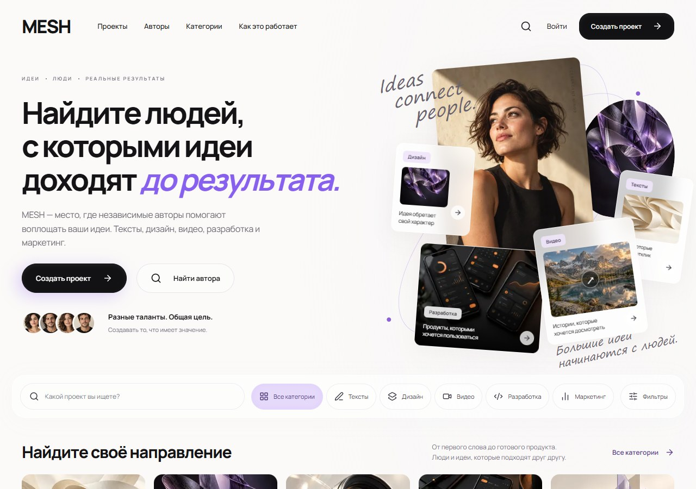

Editorial discovery introduces projects, categories and creators. The catalogue is backed by the Rails API; this image is captured after project data arrives.

[Relevant code](../apps/api/packs/marketplace)

### 02 / People: Loaded creator profiles

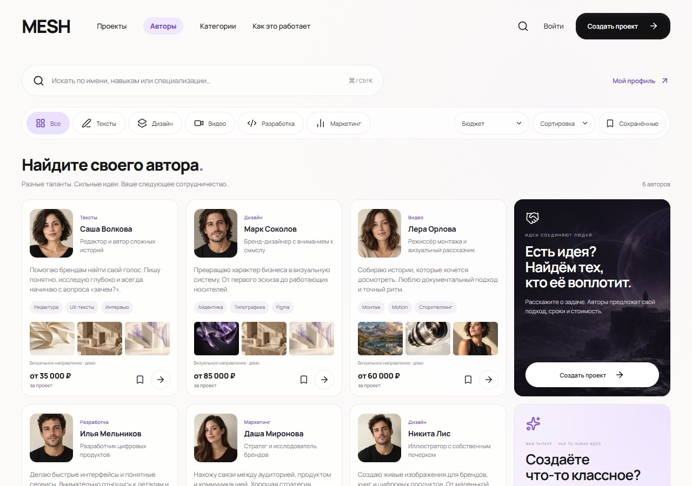

Six actual synthetic profiles, skills and prices. Cards and all visible images were loaded before capture. Portrait and portfolio imagery is illustrative.

[Relevant code](../apps/api/packs/talent)

### 03 / Brief: A project with explicit requirements

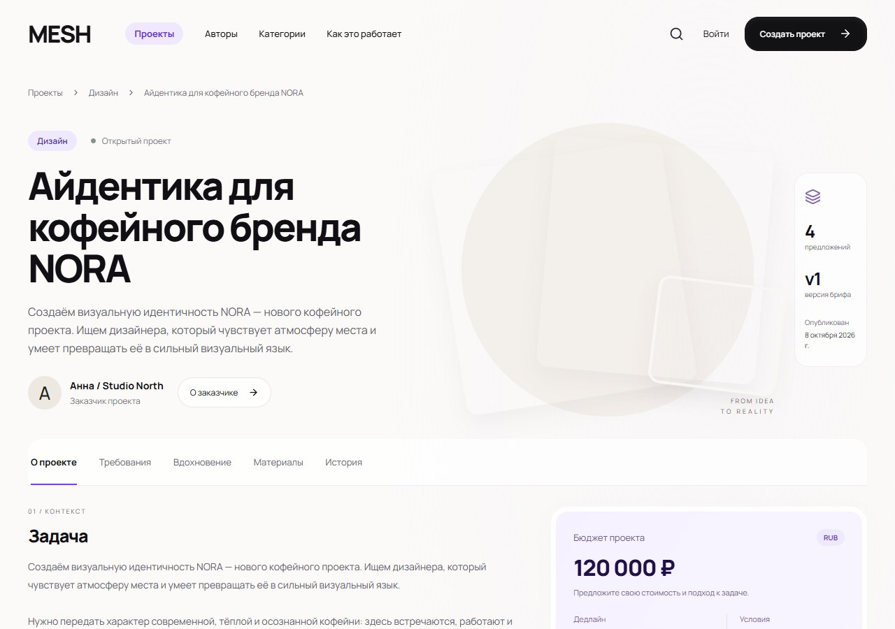

A public brief holds requirements, references, materials and versioned project information. A proposal is attached to the brief version it answers.

[Relevant code](../apps/api/packs/marketplace)

### 04 / Delivery: Conditions and concrete result versions

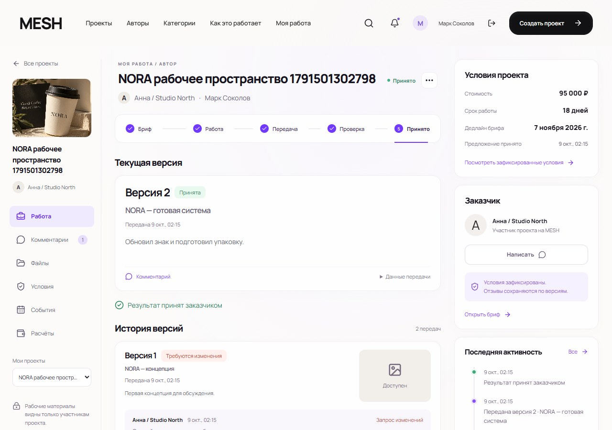

The author workspace keeps agreed cost and deadline together with submitted versions and feedback. This capture shows two real versions and acceptance of the second.

[Relevant code](../apps/api/packs/engagements)

### 05 / Integration: The operator release lab

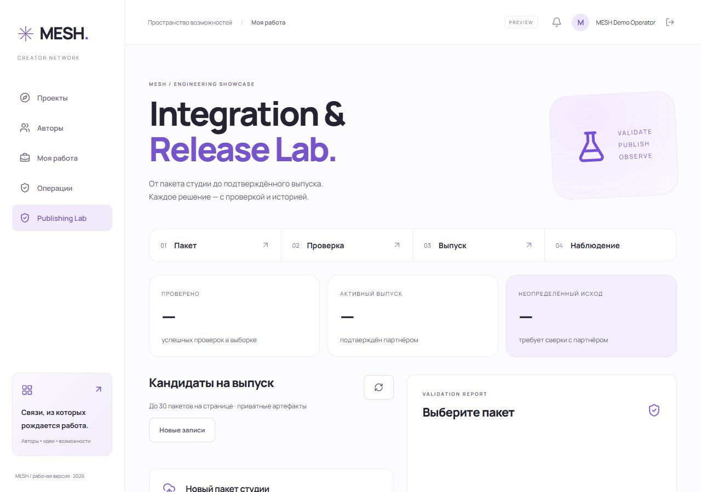

An authenticated operator works with private packages, validation reports and durable release history. The recording uses its own synthetic operator.

[Relevant code](../apps/api/packs/publishing)

### 06 / Rejection: A useful, stable defect report

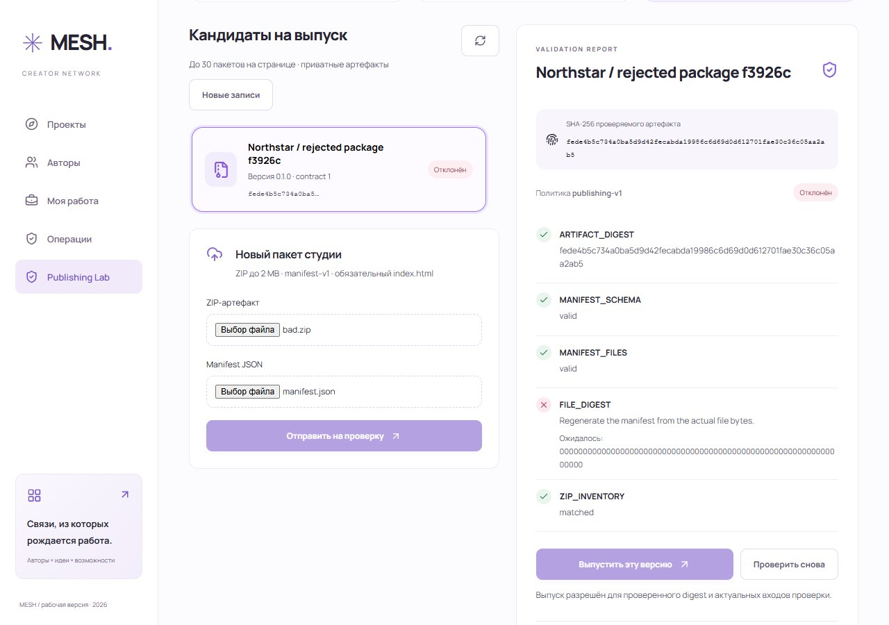

FILE_DIGEST explains the mismatch and the expected value. The rejected package cannot authorize publication.

[Relevant code](../apps/api/packs/publishing/app/services/publishing/validate_candidate.rb)

### 07 / Validation: Verified bytes and current inputs

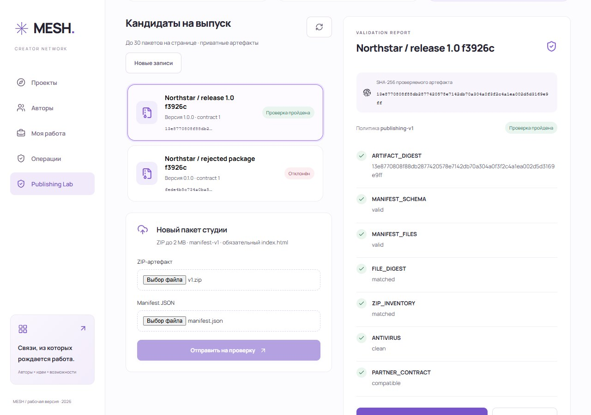

The corrected ZIP passes inventory, manifest, file-digest, real antivirus and partner-contract checks. The result is tied to policy and configuration.

[Relevant code](../apps/api/packs/publishing)

### 08 / Failure: Unknown is a protected state

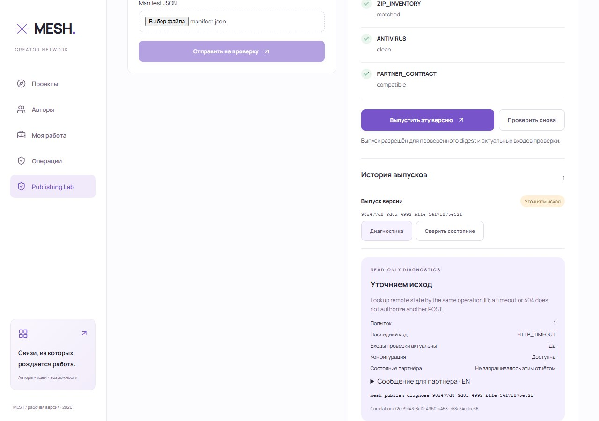

The real peer commits but its response is lost. HTTP_TIMEOUT retains the operation ID and exposes a safe lookup-only next action.

[Relevant code](../apps/api/packs/publishing/app/application/publishing/application/process_deployment.rb)

### 09 / Support: An English partner update

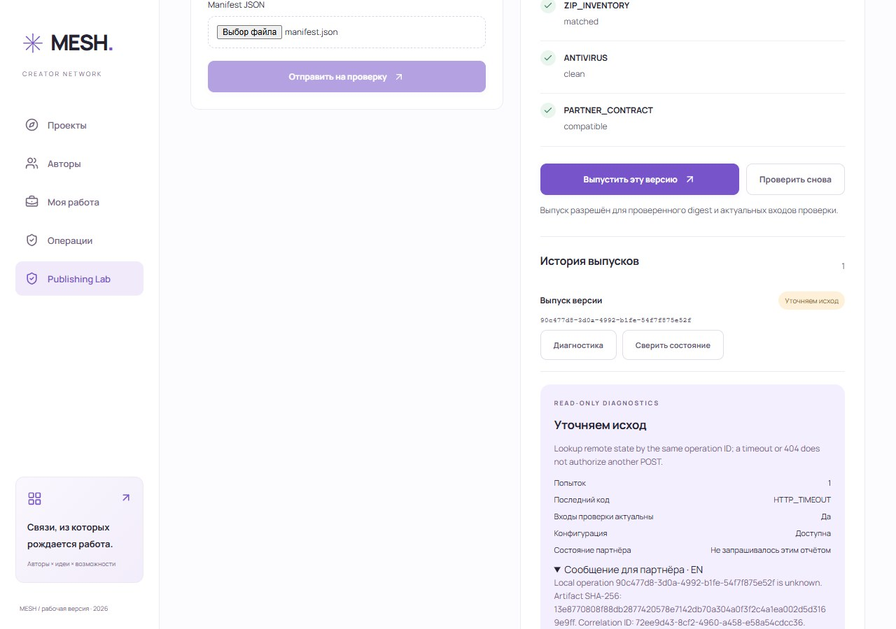

A read-only snapshot explains the state, last error and safe action. It explicitly says remote state was not queried by this report. The operator reviews the English update before sending it.

[Relevant code](../apps/api/packs/publishing/app/services/publishing/deployment_diagnostic.rb)

### 10 / Recovery: The same operation, confirmed

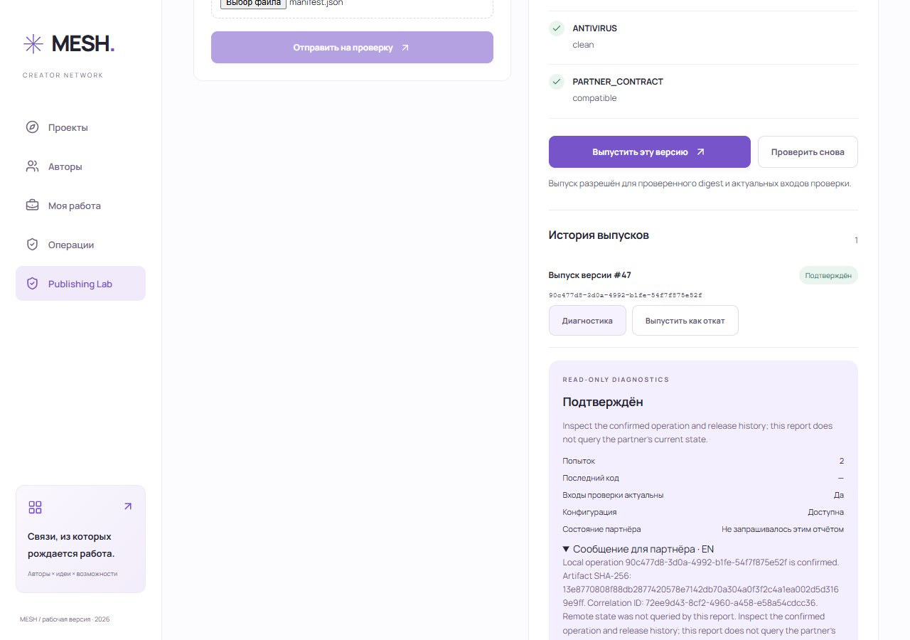

The ordinary dispatcher reconciles by lookup. The capture proof records one POST, one remote effect and the same original/recovered operation ID.

[Relevant code](../apps/api/packs/publishing/app/domain/publishing/domain/deployment_rules.rb)

### 11 / Operations: A real reliability dashboard

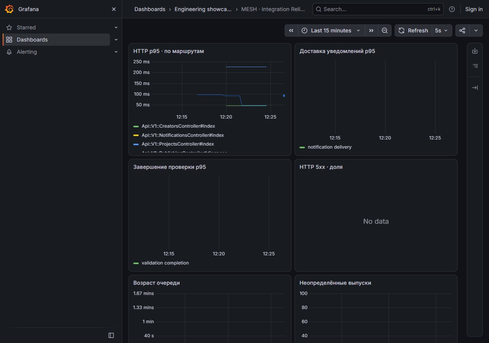

The local Grafana dashboard reads real Prometheus data: HTTP latency, jobs and unfinished work. This screenshot demonstrates a working dashboard, not a long production SLO window.

[Relevant code](../infra/telemetry/dashboard.json)

## English transcript

**00:00** — MESH: Ruby backend engineering, from partner package to a confirmed release.

**00:07** — A studio submits a private ZIP and a manifest. Validation checks exact bytes, inventory and the real scanner.

**00:13** — The bad package is rejected: FILE_DIGEST explains the defect. Publishing stays disabled.

**00:19** — A corrected package passes. The validation is bound to its digest, policy and integration configuration.

**00:30** — Inject a lost response through the real API. The independent HTTP partner commits the release before the reply is lost.

**00:36** — HTTP_TIMEOUT becomes unknown. A missing response does not authorize another publish request.

**00:38** — Read-only diagnosis provides a safe next action: look up the same operation ID. It does not query remote state.

**00:42** — The ordinary dispatcher reconciles by lookup. Confirmation must match the operation, artifact digest and sequence.

**00:56** — One real publish request, one remote effect. The captured workflow is a local simulator exercise, not a live external studio.

## Preparation from a clean copy

The [clean hosted run](https://github.com/Ingaleee/MESH-showcase/actions/runs/37909616516) started with a fresh Ubuntu checkout: no .env, node_modules, owner cache or application data. It executed the actual npm run demo, including builds, migrations, synthetic seed data, a real scanner, telemetry, ordinary workers and the partner drill. All 17 stages and four browser checks passed; readiness returned ready.

The browser runtime and host libraries were installed first, as explicit machine prerequisites. That installation is not silently counted as part of npm run demo. Windows uses Microsoft Edge; on Linux install the matching Playwright Chromium runtime:

```sh
npm ci --ignore-scripts
npx playwright install --with-deps chromium
npm run demo
```

Requirements: Node.js 22/npm, Docker with Linux containers, registry access, a supported browser and memory for the application plus ClamAV. The 17 timed preparation stages total 384.0 seconds on this hosted machine; browser installation and job setup are additional. Prepare ahead of a 15-minute interview. This duration is an observation, not a performance target.

Recording and initial clean preparation use fa40e97. The accepted application release remains 3d849af: application and demo-command code are unchanged between these revisions. The Pages workflow and English presentation are documentation/presentation additions. [Saved original preparation reports](evidence/presentation-oct09/clean-demo/summary.json) and [per-file hashes](evidence/presentation-oct09/manifest.json) distinguish this cold run from the older local single-scenario browser proof.

## Follow the engineering guarantees

- [Domain/Application/Infrastructure code map](clean-architecture.md): clean layers protect Publishing execution; the remaining Rails contexts stay idiomatic Rails.
- [Current partner support acceptance](partner-support-acceptance-oct09.md): exact source, HTTP key rotation, fencing, failure handling, hosted release/deployment and restore.
- [English partner support guide](partner-support.md): contract, stable error codes, correlation and safe next steps.
- [15-minute technical walkthrough](interview-demo.md): what to open and which tradeoffs to explain.

## What these images and video do not prove

The partner is an independent HTTP simulator, not a commercial external studio. Payments and data are synthetic; uploaded executable code is never run. The dashboard screenshot is not evidence of a long production reliability window.

Hosted environments are ephemeral. Kubernetes is single-node. Recovery uses a small, quiescent fixture. Multi-node HA, online WAL/PITR, large-restore throughput, permanent backup retention and sustained production SLOs remain unverified. The public static page serves media only and contains no backend keys. Historical reports retain their original date, source and workload.
