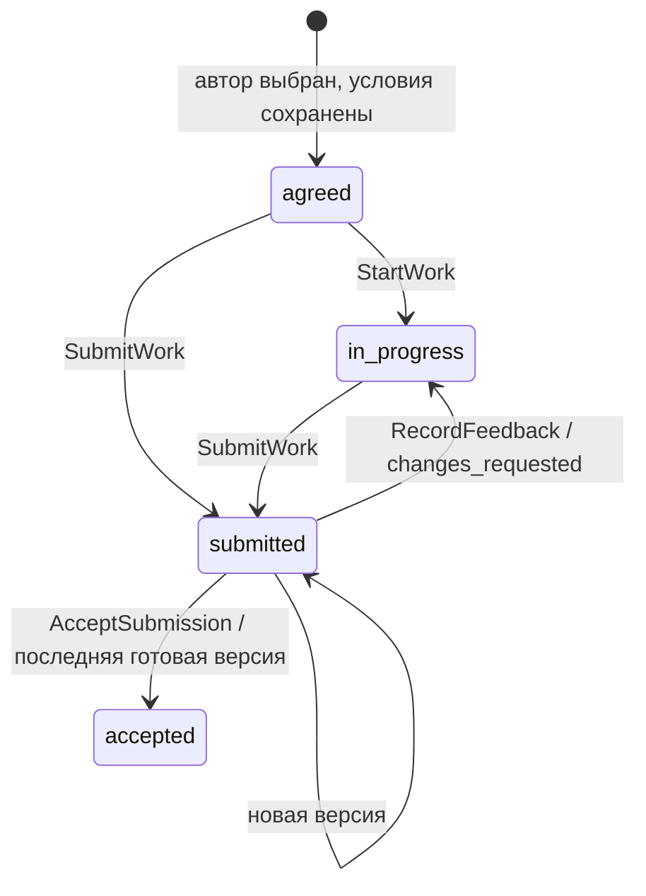

# №6 — рабочее пространство проекта

Рабочее пространство продолжает выбранное предложение: `/workspace?engagement=<id>`. Автор передаёт версии результата, заказчик обсуждает конкретную передачу, запрашивает изменения или принимает последнюю готовую версию. Главный объект экрана — результат работы и его история.

## Интерфейс

Компактная шапка, реальные участники и этапы проекта. Слева навигация по работе, комментариям, файлам, условиям, событиям и расчётам; справа условия, контакт участника и последние события. Текущая версия содержит название, текст, настоящие приватные изображения и файлы. Старые передачи сохраняют свои отзывы.

«Передать новую версию» открывает форму с названием, файлами, комментарием и явной готовностью к принятию. Без этой отметки результат передаётся для обсуждения. Черновик хранится только на устройстве, отдельно для аккаунта и соглашения; прикреплённые файлы проверяются по API при восстановлении. Выход или смена аккаунта размонтирует частное рабочее пространство; поздние ответы прежнего экрана не могут вернуть его данные.

Срок предложения и дедлайн брифа показаны отдельно: соглашение хранит оба поля, но не определяет отдельное правило отсчёта календарного срока. Интерфейс не придумывает дату завершения или формат работы. Рейтинги и процент своевременных проектов также не выдуманы.

На телефоне навигация становится горизонтальной, рабочая зона занимает всю ширину, условия находятся ниже. Native dialog поддерживает клавиатуру, возврат фокуса и Escape. Во время загрузки и записи закрытие формы заблокировано, чтобы не потерять незавершённую команду.

## Согласованность в Ruby backend

`SubmitWork` сериализует передачу на строке соглашения. В одной primary DB транзакции создаются версия, привязки файлов, audit и outbox; idempotency record сохраняет ответ этой же команды. Повтор после потерянного ответа возвращает прежний результат, даже если файлы уже закреплены за версией. Изменённое намерение с прежним ключом получает конфликт.

Номер версии выделяется под той же блокировкой. Чужой файл, уже переданный файл, повторяющийся ID, более восьми вложений или заражённое вложение не образуют новую передачу. Ошибка откатывает и состояние соглашения.

Приёмка и запрос изменений используют ту же блокировку, проверяют ID последней версии и состояние работы. Два конкурентных решения не могут оба пройти. Для обсуждаемой версии приёмка запрещена; все вложения результата должны иметь состояние available. После запроса изменений требуется новая передача. Отзыв привязан к конкретной версии, а не к изменяемому «последнему результату».

SQL triggers защищают сохранённые версии, отзывы и привязки переданных файлов от UPDATE/DELETE. Composite foreign keys запрещают прикрепить к соглашению передачу другого проекта. Бизнес-команды дополнительно проверяют роль участника. Эти ограничения не заменяют управление привилегиями production DB.

## Файлы и хеши

`WorkFile` хранит реальный SHA-256 загруженных байтов. Состав передачи сохраняется в неизменяемом `files_manifest`. Новый `manifest_sha256` охватывает название, текст, готовность и состав файлов с их хешами. `canonical-json-v1` рекурсивно сортирует строковые ключи через существующий canonicalizer платформы; чтение JSONB не меняет результат повторного вычисления. Это формат MESH, не заявление о совместимости с RFC 8785 и не электронная подпись.

Старые текстовые передачи сохранили SHA-256 текста и прежний idempotency fingerprint. Передачи первоначального демонстрационного прогона получили метку `ordered-json-v0`; миграция добавляет формат и меняет default для новых строк, не переписывая неизменяемую историю.

Файлы до 20 МБ проходят MIME-проверку по содержимому и ClamAV. До успешного сканирования скачивание закрыто. Автор видит свои загруженные черновики, заказчик — только переданные файлы; посторонний участник не имеет доступа. Публичные Active Storage URL по-прежнему отключены. Превью получают байты через авторизованный endpoint и освобождают object URL при размонтировании.

Архив относится к выбранной версии, содержит только её проверенные файлы и ограничен 50 МБ исходных байтов. Rubyzip формирует настоящий ZIP; пути удаляются из имён, порядковый префикс позволяет безопасно сохранить одинаковые названия. Непроверенный файл блокирует весь архив. Исторические версии можно скачать отдельно через их файловый список.

Комментарии и запросы изменений записываются вместе с outbox событиями. Notification consumer знает новые event types и дедуплицирует запись по событию и получателю. Realtime остаётся подсказкой: HTTP и сохранённая история являются источником данных. Платёжный симулятор перенесён на вкладку «Расчёты»; его recovery, ledger и dispute hold сохранены.

## Демонстрация

Отдельное соглашение NORA: [открыть](http://localhost:3100/workspace?engagement=c3a1bdb8-8264-4164-b1d7-2d06dd70ea2f). Автор: `design@mesh.local`, заказчик: `client@mesh.local`, пароль: `MeshDemo2026!`.

Две настоящие передачи, замечание к первой и ожидающая проверки вторая. Файлы — объявленные демонстрационные изображения MESH, прикреплённые через файловую модель и прошедшие реальный сканер. Повторный seed сохраняет действия участников. Публичный бриф и проект №5 не выбирают автора автоматически.

[Скриншоты и результаты проверки](screenshots/workspace-redesign/README.md). Rails проверки используют только выделенную `mesh_test`; browser E2E создают собственные соглашения в development стенде. Production frontend проверяется отдельно с проксированием private API к этому стенду.

## Границы реализации

Это версии результата и обсуждение в контексте проекта. Отдельный realtime чат, онлайн-редактор, этапы контракта, автоматический расчёт рабочего календаря и изменение согласованных условий требуют отдельной модели. Сейчас нет публичных ссылок на результаты, email уведомлений, хранения S3/CDN или retention policy для файлов и локальных черновиков.

ZIP собирается в памяти с ограничением размера. Для больших результатов потребуется потоковый ответ или фоновый экспорт; добавлять его следует после измерения нагрузки. Список показывает последние 40 соглашений, а прямой URL дополнительно загружает выбранное соглашение за пределами списка. Курсорная пагинация пока не реализована.
